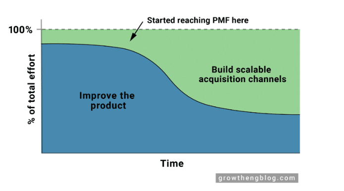
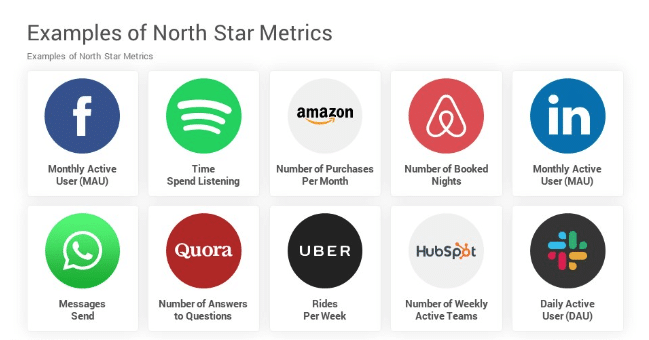

The startup journey is all about making sure all the pieces fit together seamlessly. You begin with Product-Market Fit (PMF), ensuring a demand for your product.

Then, you delve into Product-Channel Fit, ensuring a smooth delivery to customers.

Next, Channel-Business Model Fit becomes crucial, aligning how you sell your product with your revenue model.

Lastly, Business Model-Market Fit examines whether your money-making strategy aligns with your market.

Delving into the multi-dimensional fit framework, we explore how various alignments beyond Product-Market Fit contribute to startup success.

Through detailed aspects of market assessment, product development, channel selection and business model we unravel the nuanced layers that build a thriving venture.

#### Contents

## Market-Product Fit

The shift in terminology from Product-Market Fit to Market-Product Fit subtly yet significantly highlights the importance of understanding the market before embarking on product development.

This rephrasing reminds entrepreneurs to first fully comprehend market demands, and then tailor their products to meet these specific needs, laying a firmer foundation for startup success.

### Market Assessment

#### Entry

Choose markets where high entry barriers - like capital requirements, technological challenges, or regulatory compliance - deter a surge of competitors. This can afford a competitive edge to startups adept at navigating these barriers. For example, the biotechnology sector often presents high entry barriers due to its complex research and development needs.

#### Need

Address pressing problems or fulfil fundamental needs for your target audience. Your product won't capture the entire market, but there’s always a niche you can exploit by differentiating your product or service in a way that offers unique value.

- Complaints: Use customer complaints about competitor products as valuable insights for improving your offerings.
- Inconvenience: Tackle common inconveniences or frustrations customers experience in the market, akin to how [Dyson](https://www.lb.dyson.com/en-LB/community/aboutdyson.aspx) revolutionized vacuum cleaners by addressing the common problem of losing suction.
- Simplification: Create user-friendly products to reduce the knowledge gap between the market and the product. Enhance user knowledge of product usage through comprehensive articles, FAQs, tooltips, and customer service.

#### Wants

Serve the desires or wants of the market, which can also carve out a valuable market position. Products or services in this category enhance lifestyle, provide enjoyment, or fulfil desires beyond basic needs, like how luxury brands such as [Burberry](https://www.linkedin.com/pulse/how-burberry-executed-one-most-successful-brand-identity-desai/) cater to lifestyle enhancement.

#### Customer Service Gaps

Identify and fill gaps in customer service left by current market players. For instance, [Amazon’s focus on customer service](https://aws.amazon.com/executive-insights/content/the-imperatives-of-customer-centric-innovation/) filled a significant gap in the early days of online retail.

#### Geographical Arbitrage

Replicate a successful business model from one region in another where there’s an unmet need. Spotify's expansion into new geographical markets is a prime example.

#### Crowd Feeding

Pinpoint and cater to underserved segments in large or crowded markets.[Monzo's approach to banking for the digital age](https://www.fastcompany.com/90214137/british-bank-monzo-is-targeting-teens-and-their-piggybanks) targeted a younger, tech-savvy demographic previously overlooked by traditional banks.

### Market Timing

#### Market Readiness

Gauge if the market is ready to understand and accept your product. Launching too early or too late can lead to challenges.

#### Regulatory Environment

Examine the regulatory landscape to ensure it’s favourable for your product. Stay aware of any impending regulatory changes.

#### Competitor Movement

Keep an eye on competitor activities. A flux of competitors entering or leaving the market can indicate market maturity or saturation.

#### Economic Factors

Consider economic conditions, consumer spending trends, and the investment climate as indicators of market timing.

#### Consumer Behaviour Shift

Monitor shifts in consumer behaviour that might signal a growing need for your solution, similar to how the rise in remote working spiked demand for digital collaboration tools like [Zoom](https://www.vox.com/recode/21726260/zoom-microsoft-teams-video-conferencing-post-pandemic-coronavirus).

##### Do you have a brilliant idea that you want to bring to life?

From the product and business reasoning to streamlining your MVP to the most important features, our team of product experts and ex-startup founders can help you bring your vision to life.

Let's Talk

## Product-Channel Fit

Achieving a Product-Channel Fit means ensuring that your product effectively reaches its target audience while also maximising the distinct features of the chosen distribution channel to boost user engagement and satisfaction.

This alignment is key to facilitating a smooth journey from product discovery to regular usage.

To optimally leverage Product-Channel Fit, one key strategy is Product Adaptation. This involves modifying or customising your product to align with the specific attributes of your distribution channel.

Effective Product Adaptation ensures that the product not only fits within the channel but also resonates with the channel’s audience, thereby enhancing user experience and engagement. Here’s how Product Adaptation can be implemented in different scenarios:

### User-Generated Content Platforms (SEO)

If your primary channel is a platform that thrives on user-generated content, like social media or review websites, encourage user interaction and content creation. For example, TripAdvisor and Yelp have successfully leveraged user reviews to enhance their offerings and increase their appeal. Pinterest, on the other hand, optimises its platform to encourage users to create and share visual content, effectively driving engagement.

### E-Commerce Channels

If selling through e-commerce platforms, streamline your product's packaging and presentation for online showcasing. Amazon sellers, for instance, often modify their product images and descriptions to stand out in a crowded online marketplace.

### Mobile Applications

For products distributed via mobile apps, ensuring an intuitive and mobile-friendly interface is key. Apps like Uber and Deliveroo have designed their interfaces to make navigation, ordering, and tracking as seamless as possible for users on the go.

In each case, understanding and leveraging the unique properties of your chosen channel can significantly enhance the reach and appeal of your product, creating a more effective and satisfying experience for your users.

Related: [How to Build a Successful Minimum Viable Product (MVP) in 3 Steps](https://altar.io/features-inside-mvp-3-steps-know-answer/)

## Channel-Business Model Fit

Achieving a Channel-Business Model Fit is essential for effectively reaching and serving your target market, optimizing your marketing expenditure, and ultimately fostering sustainable growth. This fit involves strategically selecting distribution channels that are in harmony with your business model, particularly in terms of customer acquisition costs and revenue potential.

### Channel Selection

When choosing a distribution channel, it's crucial to consider how it aligns with your business model, especially concerning your average annual revenue per user (ARPU). This decision can significantly impact your customer acquisition costs and overall profitability.

#### High ARPU Models

If your business has a high ARPU, investing in channels with higher acquisition costs can be justified. These might include:

- **Paid Advertising:** Channels like Google Ads or paid social media campaigns, suitable for products or services with a higher profit margin. For instance, luxury brands or enterprise software companies often use high-cost advertising channels to target their niche markets.
- **Direct Sales:** Employing a sales team for direct outreach and relationship building, which is common in B2B models or high-value B2C items like luxury cars or real estate.

#### Low ARPU Models

Businesses with lower ARPU should focus on channels that require lower investment but can reach a large audience. Examples include:

- **Virality:** Leveraging viral marketing or referral programs. Dropbox, for example, successfully used a referral program to rapidly increase its user base without incurring high acquisition costs.
- **User-Generated Content and SEO:** Encouraging user-generated content to boost organic reach. Websites like Wikipedia or user-review platforms like TripAdvisor rely heavily on content created by their users, which helps in achieving a wide reach with minimal marketing spend.

In summary, the choice of distribution channels should be closely aligned with your business model's revenue and cost structure to ensure efficient market penetration and sustainable growth.

Related: [How to Shape a Startup Product That Will Be Adopted by The Market](https://altar.io/how-to-shape-a-startup-product-that-will-be-adopted-by-the-market/)

## Business Model-Market Fit

Next, we have Business Model-Market Fit. It’s a crucial factor in ensuring that your business strategy is not only aligned with, but also adaptable to, the financial dynamics of your target market. This alignment is key to setting a foundation for viable and sustainable growth.

### Business Model Assessment

The assessment involves evaluating whether your business model is compatible with the economic realities of your market:

#### Market Size and Willingness to Pay

Determine the size of your market and how much your potential customers are willing to spend. This will guide whether you target a niche market or a broader audience.

For example, a luxury car brand may target a smaller customer base willing to pay a premium, whereas a mobile app developer might aim for millions of users with lower individual revenue, relying on volume.

#### Adapting to Market Realities

Adjust your business model based on the market's capacity. This might mean targeting 10,000 enterprise clients who could pay over $10,000 annually, as seen in B2B SaaS models like Salesforce. Or aiming for millions of users with lower individual revenue, typical in ad-supported platforms like Facebook.

### Business Strategy

Your business strategy acts as the guiding force in navigating market complexities. Here are some tips to ensure you get it right.

#### Control

Maintain control over essential aspects of your business to mitigate external risks. This could involve retaining key intellectual properties or control over the supply chain, as Apple does with its product design and manufacturing processes.

#### Scale

Design your business model for scalability, aiming to grow revenue significantly without a proportional increase in resources. Amazon's use of a scalable e-commerce platform is a prime example, allowing it to expand globally without commensurate increases in costs.

#### Clear Goals and KPIs

Establish clear, measurable objectives and key performance indicators (KPIs). This might include setting targets for customer acquisition, market penetration, or revenue milestones. For instance, Netflix sets clear subscriber growth targets as a key metric for its success.

Overall, Business Model-Market Fit is about aligning your business model with the market’s financial landscape and strategically steering your venture towards growth, scalability, and stability.

## Founder-Product-Market Fit

Founder-Product-Market Fit represents the crucial harmony between a startup's team, its product, and the prevailing market dynamics. This synergy is foundational for fostering innovative solutions, ensuring timely execution, and achieving resonance with the market.

### Team Alignment

A startup's success is heavily reliant on having a motivated, informed, and skilled team. This alignment ensures the team is capable of creating a product that is not only great but also right for the market at the right time.

For example, [the early team at Spotify](https://www.linkedin.com/pulse/how-spotify-became-global-leader-music-streaming-industry-kumar/) had a mix of tech and music industry expertise, which was key to its innovative approach and market understanding.

### Technological Readiness

It's vital to ensure that the technology needed to develop or deliver your product is not only mature but also accessible and economically viable for your business model.

A case in point is the development of electric cars by Tesla, where their success was partly due to the timing of their entry when battery technology had matured enough to be viable for electric vehicles.

### Operational Efficiency

In the initial stages, it might be necessary to adopt approaches that don’t scale, in order to better understand the market and user needs.

This could include hands-on customer service or direct engagement with users, similar to how [Airbnb founders visited hosts' homes](https://www.businessinsider.com/how-airbnb-was-founded-a-visual-history-2016-2) to understand their experiences and needs better.

### Speed and Agility

The ability to make quick decisions and adapt swiftly is a cornerstone of startup success. This agility allows startups to pivot or make strategic changes in response to market feedback or changes. A notable example is [Instagram](https://medium.com/international-school-of-ai-data-science/the-tale-of-burbn-to-instagram-a9035df134b6), which quickly pivoted from a cluttered social app to a streamlined photo-sharing app based on user feedback and market trends.

Related: [12 Product Leaders You Should Follow as a Startup Founder](https://altar.io/product-leaders-you-should-follow-in-as-a-startup-founder/)

## Wrapping Up

Startup success extends far beyond the realm of Product-Market Fit. It's about a harmonious alignment across multiple dimensions. From understanding and responding to market demands, adapting products to suit chosen distribution channels, aligning your business model with the realities of your market, to ensuring your team is in sync with your product and market dynamics.

Each aspect, or “fit”, serves as a vital cog in the machinery of startup success. They represent the multifaceted nature of building a business, where each element must be carefully considered and aligned for a startup to not only survive but thrive.

Remember, the journey of a startup is akin to navigating a complex puzzle. Each piece must fit perfectly to complete the picture.

As we've seen through various examples, from the adaptive strategies of companies like Airbnb and Instagram to the visionary approaches of Tesla and Spotify, the key lies in not just identifying these pieces but understanding how they seamlessly fit together.

As you embark on or continue your entrepreneurial journey, consider these multifaceted fits as your roadmap. They are not just steps to follow but are integral to the DNA of your venture.

By mastering this multi-dimensional alignment, you're not just aiming for immediate success; you're building the foundation for sustainable growth and lasting impact in the ever-evolving world of startups.
