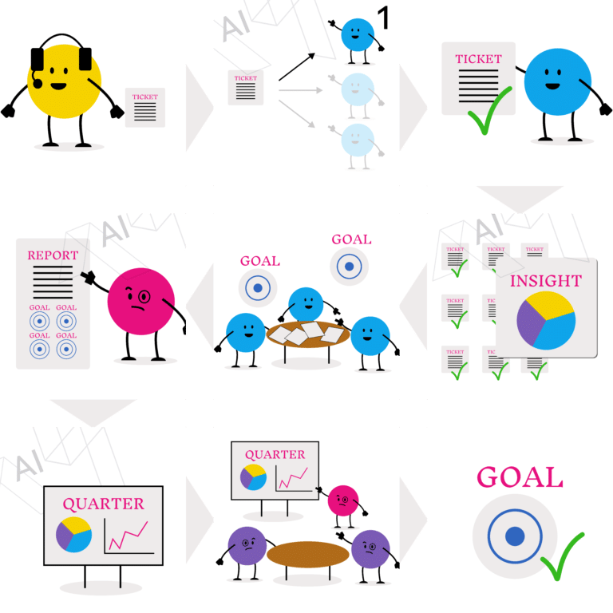

As companies navigate the digital transformation, the move towards Generative AI and AI enablement is becoming increasingly prominent.

What began as grassroots adaptability has now escalated to a critical agenda item for top-level executives.

It's not just about pioneering startups harnessing this groundbreaking technology; well-established corporations are also exploring how to adopt it on a grander scale to drive business innovation and operational efficiency. [According to PwC](https://www.pwc.com/us/en/tech-effect/ai-analytics/ai-predictions.html), 73% of US companies have integrated AI into some aspects of their operations, with generative AI (GenAI) being a key focus.

However, the pressing question remains: Are they implementing it correctly?

Developing an AI strategy for your company extends far beyond merely training employees to use tools like ChatGPT or creating a customer-facing chatbot. True AI enablement involves a deep understanding of AI capabilities and aligning them with specific business needs.

It's about adopting a holistic approach that marries a Product Mindset with an Operations Mindset, enabling businesses to transform inefficiencies and bottlenecks into streamlined, AI-driven processes.

This comprehensive strategy paves the way for AI-driven innovation operational efficiency, setting the stage for a transformative impact across all facets of the company.

#### Contents

## How Companies Are Currently Tackling AI Enablement

Whilst companies are earnestly integrating AI into their operations, [much of their effort is currently focused at the individual level](https://www.accenture.com/us-en/insights/consulting/gen-ai-talent).

AI's interaction is predominantly with single users – be it an employee or a customer – through interfaces like chatbots that cater to immediate requests.

Internally, content generation and knowledge access are becoming increasingly popular, alongside customer support and visual assistance for client interactions.

Yet, these initial steps, while impactful, only scratch the surface of what's possible.

The essence of AI enablement remains largely untapped. Beyond the realm of big tech and niche AI services, comprehensive AI-driven innovation and operational efficiency are still in their infancy for most enterprises.

As I delve deeper into this topic, I'll uncover why transitioning from these foundational applications to a holistic AI integration in business strategy is not only beneficial but essential for staying competitive in today's digital landscape.

##### Looking to Integrate AI into Your Business?

Get straight to the point, jargon-free advice on transforming your tech strategy by leveraging AI from an expert that has been building award-winning Startups for the past 10 years.

Let's Talk

## The Full Potential of an AI Strategy

When embraced holistically, AI enablement transforms not just isolated tasks but the entire operational fabric of a company.

Generative AI serves as a catalyst for efficiency and innovation, not only at the individual employee or customer level but across the entire organisation.

From customer-facing applications to internal decision-making tools, a robust AI strategy synergises the company into a cohesive, more efficient whole. Imagine the transformative power of AI through the following sequence in a medium-sized web service company:

1. A customer reports a problem via a chatbot, initiating a support ticket.
2. This ticket is automatically assigned to the appropriate team.
3. The team receives AI-generated suggestions for resolving the ticket swiftly.
4. Resolution of the ticket generates valuable insights for the product development team.
5. The product team leverages these insights to refine their roadmap.
6. Insights and trends are compiled into a report for the VP of Product, influencing quarterly projections.
7. AI tools craft a comprehensive presentation for the board meeting.
8. Strategic decisions made in the board meeting guide the company's direction.
9. The company revises its goals based on these insights, continuing this cycle of improvement.

This scenario illustrates just one of countless workflows where AI can be integrated to create a chain of value, demonstrating that the potential of "AI enablement" extends far beyond individual contributions to encompass the entire company.

Once these AI-enhanced processes are established, not only is productivity boosted, but a macro view of the company's operations becomes clearer.

AI enables qualitative measurement of department outputs, speed of execution, decision-making efficiency, and work quality, all of which can be leveraged as key performance indicators (KPIs).

The real magic lies in how AI enablement transforms these insights into actionable strategies, enhancing every facet of the business.

This is the essence of leveraging AI—not just automating tasks, but reimagining the entire business model to foster a dynamic, responsive, and continuously evolving organisation.

## Important Considerations When Tackling AI Enablement

In theory, the journey of AI enablement is an exciting opportunity. However, translating this excitement into practical, effective strategies is often more complex than it appears.

Issues like maintaining data integrity and fostering commitment to new processes frequently emerge as contentious points, necessitating a tactful, diplomatic approach across various stakeholders. Indeed, companies that proactively develop and solidify their AI strategies are more likely to lead in the evolving digital landscape.

To start your AI strategy, here are some key aspects to discuss to start the shift into an AI-driven organisation:

### 1\. Review your Data

Embarking on the path to AI enablement necessitates a fresh look at your company's data landscape. Traditionally, data might conjure images of spreadsheets filled with numbers, labels, and descriptions.

Yet, the advent of generative AI has broadened the horizon, ushering in an era where text, images, sound, video, and code become equally valuable as actionable data.

The cornerstone of an effective AI strategy lies in the [comprehensive harvesting of information your company produces](https://www.mckinsey.com/capabilities/mckinsey-digital/our-insights/the-data-dividend-fueling-generative-ai).

By embracing this expanded definition of data, businesses can unlock unprecedented insights and opportunities.

This step is not just about data collection but understanding how to transform diverse data types into a strategic asset, paving the way for innovative applications and enhanced data management in AI.

It's about laying the groundwork for a future where every piece of information, regardless of its format, contributes to a holistic view of your organisation's operations and growth potential.

<figure>

<figcaption>

Before and After Generative AI: Before generative AI (left), regular companies could only process typical quantitative data at a large scale. With Generative AI (right), all types of data are now available for processing without complex implementations. Content, Audio, Video, Images and much more can now be interpreted and used for insight generation and decision-making.

</figcaption>

</figure>

### 2\. Tooling Ecosystem

Selecting the appropriate tools is a cornerstone of successful AI enablement within any organisation.

Understanding the mechanics of Generative AI—how it processes inputs and generates outputs—is essential for effectively leveraging AI throughout your company's operations.

Take, for instance, the importance of standardising text formats to ensure they're readily interpretable by AI systems without losing their visual structure. This dual readability facilitates seamless collaboration between humans and AI, enhancing productivity and creative output.

Similarly, the adaptability of presentation materials, such as those in markdown format, allows for easy editing and programming, making it simpler for AI to assist in both commercial and internal presentations.

The essence lies in the level of tool abstraction; the more adaptable the tool, the smoother the integration of AI into your business ecosystem, fostering communication across different activities.

Tools designed to balance advanced programmability with user-friendly interfaces—for tasks ranging from content creation to coding—are invaluable.

They not only streamline the process of AI integration in your business but also empower employees to work more efficiently alongside AI, pushing the boundaries of what's possible in efficiently leveraging AI.

### 3\. API Integration

APIs, traditionally viewed as conduits for offering specific services within product backends, hold untapped potential far beyond their conventional use.

Their application should extend into the realm of internal operations, acting as a catalyst for AI enablement within companies. Often, internal inefficiencies arise from delayed communications and the distortion of information as it travels through the company's hierarchy—commonly known as the "Chinese Whispers" effect.

By [implementing robust internal APIs](https://www.mckinsey.com/capabilities/mckinsey-digital/our-insights/what-it-really-takes-to-capture-the-value-of-apis), companies can dramatically streamline these processes, ensuring swift, transparent access to data across departments.

Such an integrated approach not only accelerates the flow of information but also enhances the ability of AI systems to generate and process requests with greater speed and accuracy.

This seamless data exchange facilitated by APIs is instrumental in creating a more responsive, interconnected, and agile organisational structure.

Therefore, when sculpting the tooling ecosystem of your business, the inclusion of APIs emerges as a pivotal strategy. They are not merely tools for external interaction but foundational elements that empower AI-driven data processing and cross-departmental data access, fostering a culture of innovation and efficiency.

### 4\. Privacy and Ownership

As companies venture deeper into "AI enablement," the choice between proprietary and open-source AI models becomes a critical strategic decision. While proprietary AI models, such as GPT-4, Claude, and Gemini, offer powerful capabilities, they also introduce risks related to operational dependency and data privacy. Relying exclusively on such models can lead to a significant dependence on their providers, potentially compromising the autonomy of your company's operations and the privacy of your data.

To navigate these challenges, considering open-source AI solutions becomes essential.

These models offer the flexibility to be custom-tailored for specific tasks and can be hosted on private clouds, offering an added layer of security and control.

This strategic balance between proprietary and open-source technologies is crucial for developing an "AI strategy" that is both effective and aligned with your company's privacy standards.

By carefully selecting your AI tools and considering the implications for "data privacy in AI," you can safeguard your company's independence and ensure a secure, robust foundation for your AI initiatives.

### 5\. Safety and Responsibility

The power of AI, while transformative, comes with inherent risks that demand responsible management.

An effective AI strategy exercises extreme caution in delegating decisions to AI systems. Given that [generative AI operates on a probabilistic basis](https://www.nvidia.com/en-us/glossary/generative-ai/), it is susceptible to generating errors and misjudgments.

This reality underscores the imperative for consistent human oversight of AI-driven systems, particularly when navigating sensitive data and making critical decisions.

The presence of human judgment alongside AI's capabilities is not just a safety measure but a commitment to ethical AI use, ensuring that technology serves to augment rather than undermine human values and decision-making integrity.

Incorporating robust AI safety measures and prioritising human supervision in AI within your strategy are essential steps towards mitigating risks and fostering trust in AI applications.

By acknowledging the limitations and potential of AI, you can navigate challenges responsibly, ensuring that AI enablement aligns with ethical standards and organisational goals.

##### Sign up for our newsletter

Join hundreds of entrepreneurs and business leaders to receive  
fresh, actionable tech and startup related insights and tips

Full Name Business Email Subscribe

## Where to Start with AI Enablement

Embarking on AI enablement might seem daunting due to the inherent complexity of organisational structures and the diverse habits and workflows present.

However, adopting a simplified and universal approach can demystify the process. Here’s how to pragmatically initiate your company's journey towards effective AI integration:

- **Communication:** Initiate with open dialogue. Transparently share the vision, benefits, and responsibilities associated with AI enablement, ensuring all stakeholders are aligned and engaged from the outset.
- **Process Audit:** Conduct a thorough review of your current tools and processes by assembling a dedicated team. This step, often facilitated through interviews with key stakeholders, helps identify areas ripe for AI integration and improvement.
- **Data Acquisition:** Post-audit, prioritise the capture and utilisation of all forms of data generated by your company. Beyond just the right tools, focus on collecting valuable information like content, meeting transcripts, and customer feedback, laying the groundwork for data-driven AI applications.
- **Local Empowerment:** Empower individuals or teams within departments who exhibit a strong product mindset and technical acumen. These champions can spearhead AI-driven process enhancements, acting as catalysts for change within their areas.
- **Communicate Findings:** Encourage a culture of transparency and collaboration by sharing insights and progress across departments. This collective brainstorming and discussion pave the way for negotiating and finalising AI implementation strategies that benefit the entire organisation.
- **Design a Strategy:** With all insights and team feedback in hand, craft a comprehensive AI strategy that balances global vision with departmental autonomy. This ensures a cohesive approach to AI enhancement while leveraging the unique strengths of each department.

## Implementation and the Future

With a solid grasp of your company's operational dynamics and the identified avenues for AI-enhanced improvement, the next step is to move from theory to practice.

Establishing a dedicated team for AI implementation is crucial. This group should operate at a strategic level, ensuring seamless integration of AI initiatives across various departments. While it's tempting to rely solely on in-house product experts and developers, the challenges of juggling day-to-day responsibilities with transformative projects can impede progress. Additionally, internal efforts might inadvertently perpetuate outdated practices.

In light of these challenges, engaging an external team might offer a fresh perspective, infusing your AI strategy with new ideas and mitigating the influence of existing biases. External experts can provide the focused attention and innovative approaches needed to elevate your AI initiatives, driving meaningful change without the constraints of internal routines.

### Re-Skill Your Workforce

A common concern when discussing AI integration is the impact on employment. Rather than viewing AI as a replacement for human talent, consider it an opportunity to enhance the capabilities of your existing workforce.

The efficiencies and insights generated by AI open up avenues for employees to re-skill, aligning their roles with the evolving technological landscape.

This transition not only leverages the inherent knowledge and loyalty of your team but also positions them for career advancement in a future-oriented workplace.

Demonstrating leadership in guiding your workforce through these changes not only addresses the immediate needs of AI strategy implementation but also fosters a culture of continuous learning and adaptation.

## Conclusion

In today's fast-evolving business environment, AI has become an undeniable force, setting a new standard for how organisations operate and thrive.

This shift towards AI enablement demands more than mere adaptation; it requires a fundamental rethinking of roles, processes, and strategies to harness the full potential of AI technologies.

While AI promises to redefine the landscape of human tasks, facilitating the creation of new job categories and opportunities, it also necessitates a balanced approach—merging optimism with prudent caution.

Business leaders are at the forefront of this transformative journey. It is incumbent upon them to navigate the complexities of AI integration with a clear vision and a commitment to ethical practices.

By embracing AI, organisations not only ensure their relevance in the modern era but also open the door to unprecedented levels of innovation and efficiency.

The call to action is clear: Invest in AI strategies that are safe, responsible, and aligned with the long-term vision of your organisation. In doing so, businesses can lead the charge towards a future where AI and human ingenuity coalesce to create value that is greater than the sum of its parts.
