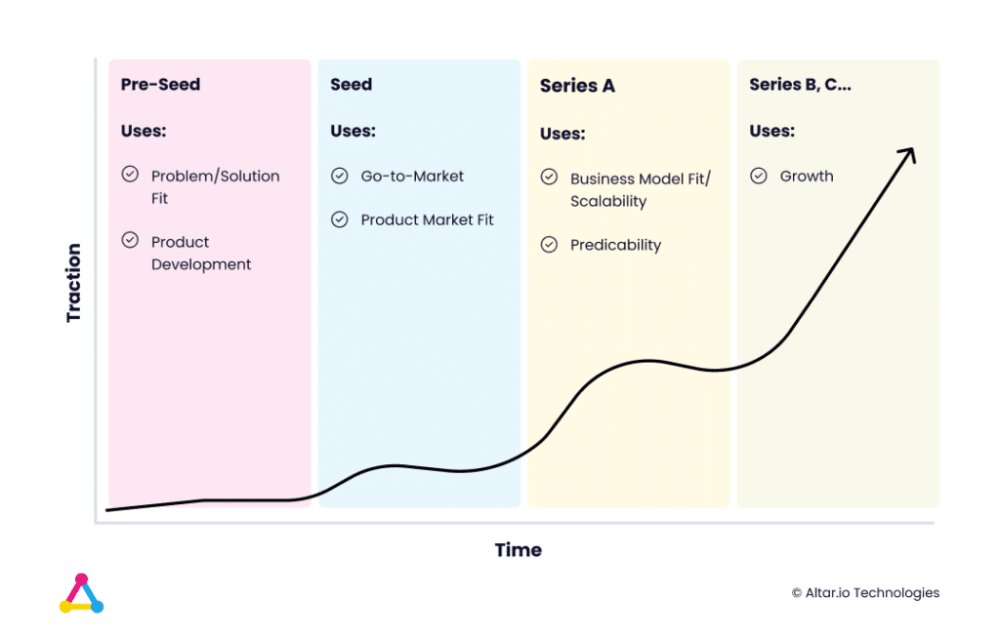
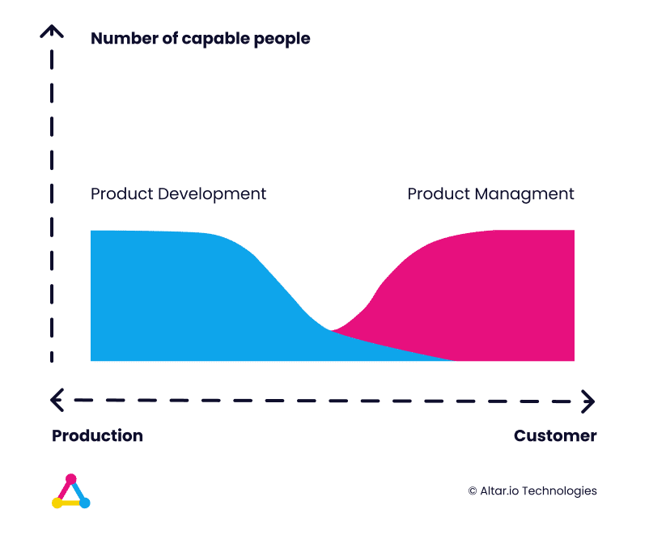
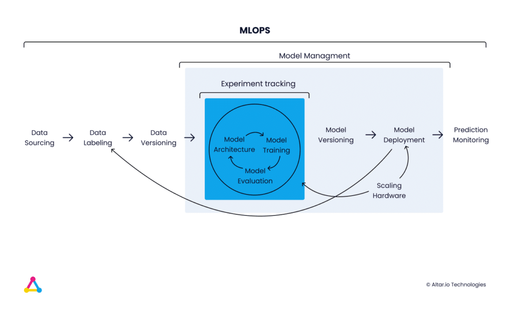
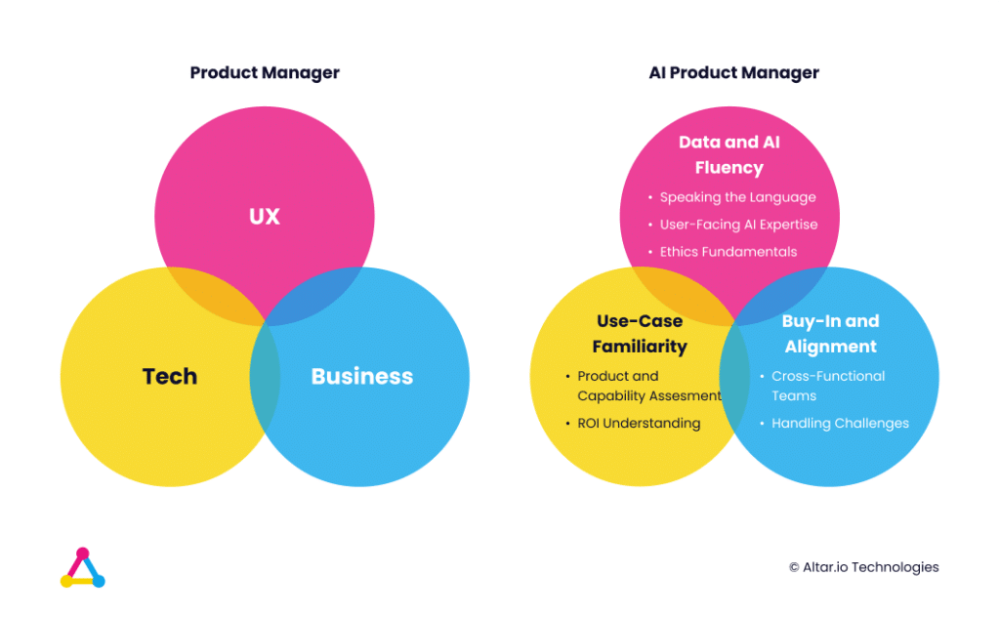
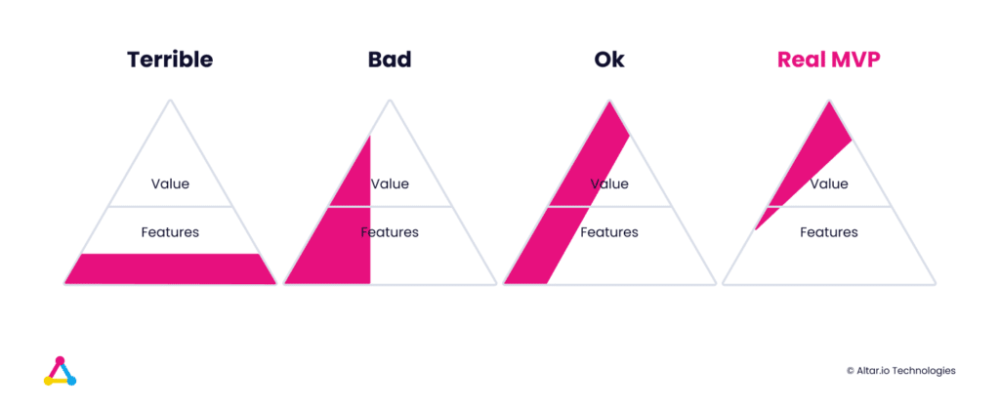
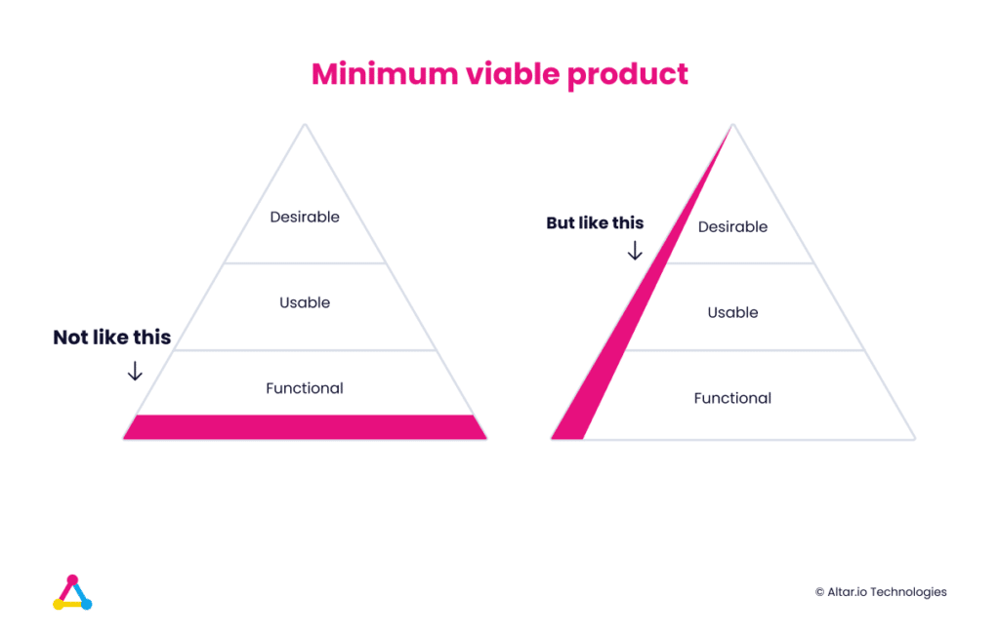
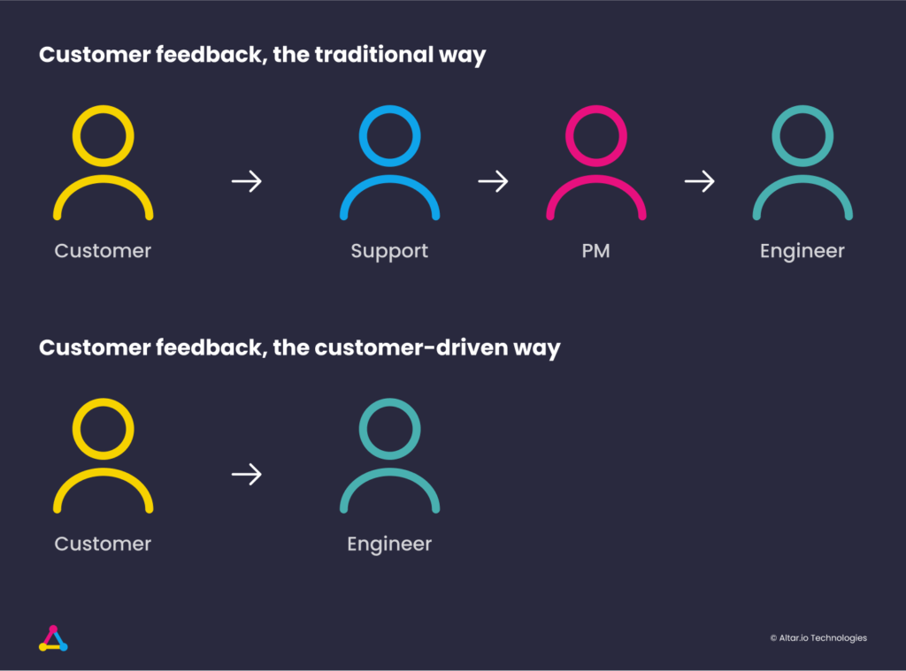
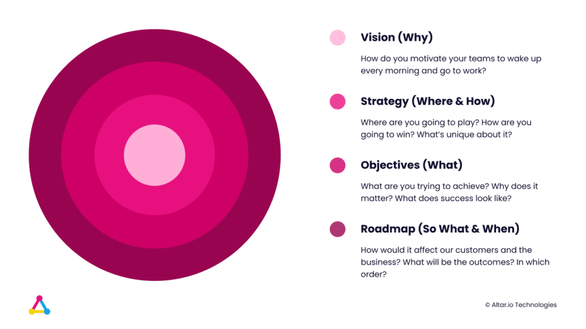
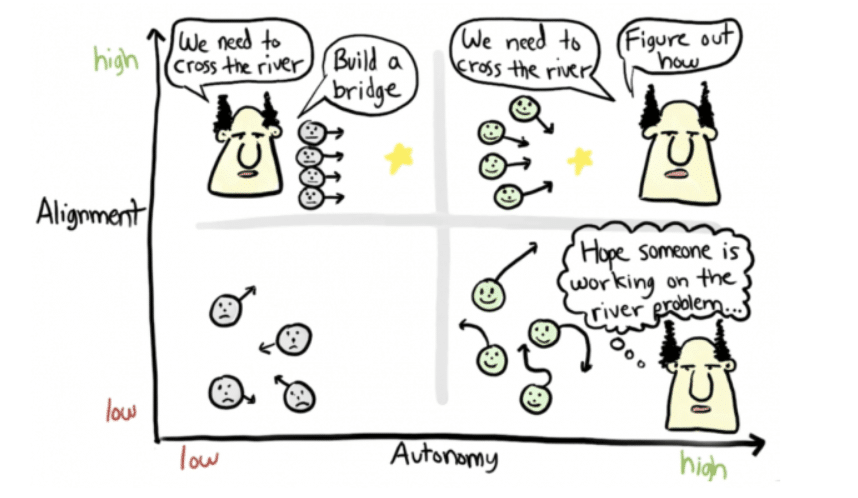
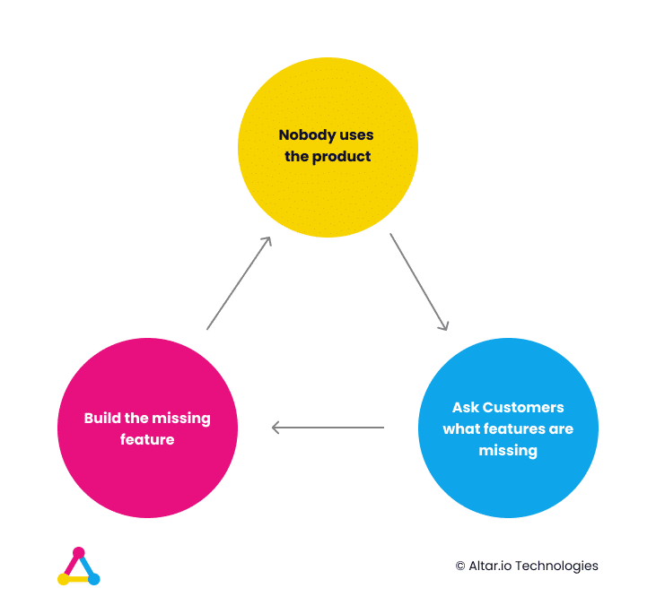

Navigating the choppy waters of startup entrepreneurship is no small feat, especially when it comes to product development.

In a landscape that's continuously evolving, staying ahead of the curve is crucial. But how do you maintain that cutting edge?

One proven strategy is to tap into the wisdom of those who've walked the path before you — world-class product leaders.

They can offer invaluable insights into upcoming industry trends, helping you stay one step ahead.

They frequently share best practices, case studies, and lessons learned, essentially serving as your virtual mentors in product management.

Engaging with these experts can also open doors to an extensive professional network and potential partnerships.

Beyond that, their experiences can be a source of inspiration and problem-solving techniques.

Plus, by setting high benchmarks based on their achievements, you inherently elevate your own product's quality.

Lastly, many produce actionable educational content like how-to guides, webinars, and ebooks, acting as a cost-effective resource for you and your team.

In this article, I’ll share the 12 leaders I think you should be following in 2024.

But first, I want to categorise them both in terms of expertise and the company stage they operate in.

#### Contents

## The Different Breeds of Product Leaders

In the intricate landscape of product and software development, the role of a Product Leader is not one-size-fits-all.

Depending on the stage of your company and your unique needs, various types of Product Leaders come into play.

Here’s a breakdown that will help you understand whom you should be looking for at different phases of your business journey.

### Product Leaders by Company Stage

#### Pre-Seed and Seed Stage Product Leaders

At this nascent phase, a Product Leader's focus is predominantly on developing a Minimum Viable Product (MVP), validating the assumptions, and making the initial foray into the market. They are usually the ones who bring your startup vision to life by aligning it closely with consumer needs and market realities.

#### Series A Product Leaders and Beyond

Once you've secured significant funding and have a product in the market, the role shifts. The Product Leader now specialises in scaling the product, retaining users, and implementing methods to generate revenue. The Series A stage demands a more holistic view of the product that goes beyond the MVP.

### Product Leaders by Specialisation

#### R&D Product Managers

These are the researchers you’ll want to focus on when innovation is at the heart of your product. They drive advancement through cutting-edge research and new product development, ensuring they stay ahead of the curve.

#### AI Product Managers

In our rapidly advancing AI-driven world, being data-driven and applying machine learning models can offer a competitive edge. These specialists are experienced in tailoring them to solve specific business problems or enhance user experience.

#### Technical Product Managers

If you're at a crossroads in terms of product architecture or deciding on the technology stack, a Technical Product Manager’s perspective is invaluable. They delve deep into the technical aspects of the product, making choices that align with long-term vision.

#### Generalist Product Managers

These are the Swiss Army knives of product management. They cover everything from conceptualising the product to devising market entry strategies, often acting as a bridge between various functions within the company.

#### Marketing Product Managers

The magicians in customer acquisition, these managers excel in achieving product-market fit. They are attuned to market dynamics and customer needs, shaping the product in a way that resonates with the target audience.

#### Growth Product Managers

If your primary goal is business expansion, these are your go-to experts. Skilled in identifying and optimising metrics and Key Performance Indicators (KPIs), they pave the path for sustainable growth.

Now, let’s move on to the list itself.

##### Do you have a brilliant idea that you want to bring to life?

From the product and business reasoning to streamlining your MVP to the most important features, our team of product experts and ex-startup founders can help you bring your vision to life.

Let's Talk

## 12 Product Leaders You Should Follow as a Startup Founder

### 1\. Peter Welinder

Company Stage: Pre-Seed, Seed Stage, Series A and Beyond Speciality: R&D, AI, General and Technical Product Management

Value: Peter Welinder is your go-to expert for transforming AI research into market-ready products. As the VP of Product & Partnerships at OpenAI, he has successfully led the commercialization of AI technologies like GPT-4 and ChatGPT.

His focus on actionable KPIs and business metrics makes him an invaluable resource for anyone looking to turn AI capabilities into tangible business results.

Previous/Current Companies: OpenAI, Dropbox, Anchovi Labs (acquired by Dropbox), Basis Set Ventures Follow On: [LinkedIn](https://www.linkedin.com/in/welinder/)

#### Why Follow Peter Welinder?

From Prototype to Launch: Leading the OpenAI GPT-3 API from its early-stage prototype to launch, Peter exemplifies the importance of a well-executed MVP strategy. His experience can help you understand how to take a product from concept to market successfully.

Startup Advisory: As a Technical Advisor at Basis Set Ventures, Peter evaluates and advises early-stage companies. His expertise can offer you a nuanced understanding of what investors look for in startups, especially those focused on AI and the future of work.

Cross-Functional Leadership: Peter's roles have often required him to wear multiple hats, from product management to engineering and research. His experience can guide you in fostering better communication and collaboration between different departments, ensuring a more cohesive and successful product launch.

User-Centric AI Applications: With a background in machine learning and computer vision, Peter emphasises the importance of user-centric design in AI applications. His work can help you focus on creating AI products that not only are technologically advanced but also solve real-world problems and meet user needs.

Future of AI in Product Management: Stay ahead of the curve by tuning into Peter's thought leadership on the evolving role of AI in product management. His forward-thinking perspectives can help you adapt and innovate in a rapidly changing technological landscape.

Peter's extensive involvement in transforming AI research into market-ready products makes him a beacon for those struggling with team silos.

His journey offers a roadmap on how to effectively communicate the complexities of research (like AI) into actionable product strategies, ensuring both R&D and Product teams are aligned.

Plus, AI products usually require a new workflow (i.e. Machine Learning Operations - MLOps), distinct from standard DevOps (Development and Operations).

AI Product Managers require a deep understanding of AI, known as Data and AI Fluency, and must be well-versed in industry-specific AI applications, termed Use-Case Familiarity.

Their role demands consistent communication with top-tier leadership (Buy-In Alignment), flexibility in project goals, and the ability to set realistic expectations regarding AI capabilities and ROI.

Related: [How OpenAI Found Success by Being Product Driven (And How You Can Too)](https://altar.io/how-openai-found-success-by-being-product-driven-and-how-you-can-too/)

### 2\. Marty Cagan

**Company Stage**: Pre-Seed, Seed Stage, Series A and Beyond **Speciality**: Generalist, Marketing Product Management

**Value**: Marty Cagan brings decades of hands-on experience in product management, particularly in the tech startup ecosystem. His methodologies focus on empowering product teams and aligning them with customer needs, providing a structured approach to achieving product-market fit and long-term business success.

**Previous/Current Companies**: Founder and partner at Silicon Valley Product Group, former product leader at eBay, Netscape, Continuus and HP, start-ups and Fortune 500. Author of INSPIRED and EMPOWERED.

**Follow On**: [LinkedIn](https://www.linkedin.com/in/cagan/), [Newsletter](https://www.svpg.com/articles/) and [Blog Posts](https://www.svpg.com/articles/)

#### Why Follow Marty Cagan?

**Classic risks framework:** Marty Cagan's four Risks framework for effective risk management: Value Risk (akin to the Segway, which, despite its innovation, never achieved mass market appeal), Usability Risk (evidenced by the challenges of Google Glass), Feasibility Risk (as highlighted by Theranos' over promised technology), and Viability Risk (demonstrated by Kodak's reluctance to adapt to digital technology).

**Empowered Teams**: Marty's advocacy for empowered product teams can transform your business. Imagine your product development teams making decisions, driving outcomes, and innovating with a sense of ownership. This shift can lead to faster and more effective product development.

**Customer-Centricity**: Marty's focus on understanding and solving real customer problems can be a game-changer. Instead of building products based on guesswork, picture your startup creating solutions that resonate with customers, increasing the likelihood of achieving product-market fit.

**Strategic Product Development**: Marty's emphasis on a well-defined product strategy can steer your startup in the right direction. His insights will enable you to have a clear vision of your product's purpose, target audience, and competitive edge. This strategic foundation is crucial for startups seeking long-term success.

### 3\. Josh Tong

**Company Stage**: Pre-Seed and Seed Stage **Specialty**: AI Product Management

**Value**: If you're in the thick of launching an AI startup, Josh Tong's blogs are indispensable. Unlike broad overviews, Josh dives deep into specific, tactical decisions that directly impact both your product and bottom line. For instance, he's dissected the intricacies of choosing between pre-built algorithms and bespoke machine learning models. Make the wrong choice, and you could be spending thousands of dollars on unnecessary computational power, not to mention the weeks of lost time.

**Previous/Current Companies**: Head of Product at Fieldguide, CognitOps, VP of Product at SourceDay

**Follow On**: [Newsletter](https://creative-trader-7972.ck.page/935bbc6455), [Blog](https://blog.joshtong.com/) and [LinkedIn](https://www.linkedin.com/in/joshtong1)

#### Why Follow Josh Tong?

**Strategic Approach**: Emphasising the importance of carefully selecting AI projects, Josh guides businesses to invest in areas that offer the most return. For example, focusing on one problem space can lead to compounding returns and better outcomes.

**Cost-Savings**: One of the frequent pain points for AI startups is computational or engineering costs. Josh's insights on model selection can help you avoid the financial pitfall of using an overly complex model when a simpler one would suffice.

**Startup Dynamics:** With frequent references to the highs and lows of startup life, Josh provides insights into the roller-coaster ride of startup culture, leadership, and growth. His reflections on startup frustrations, the differences in startup product leadership, and the essence of startup product leadership could be invaluable to entrepreneurs and those in the startup ecosystem.

**Clarifying Misconceptions**: By addressing prevalent AI myths, Josh aids businesses in making informed decisions. For instance, he clarifies that using advanced techniques like Deep Learning doesn't always equate to more value, encouraging businesses to use techniques that best suit their needs.

Related: [6 Critical Qualities You Need in a Product Manager for Your Startup](https://altar.io/qualities-product-manager-startup/)

### 4\. Tony Fadell

**Company Stage**: Pre-Seed, Seed Stage, Series A and Beyond **Specialty**: R&D, Technical, Generalist, Marketing and Growth Product Management

**Value**: Known as one of the "fathers of the iPod," Tony Fadell's influence goes well beyond Apple's iconic product. As the founder of Nest Labs, his thought leadership extends into the Internet of Things and smart home technologies. If you're seeking a holistic approach to product management that prioritises user experience and innovative design, Tony Fadell is a must-follow.

**Previous/Current Companies**: Build Collective, Apple, Founder of Nest Labs (acquired by Google), General Magic

**Follow On:** [LinkedIn](https://www.linkedin.com/in/tonyfadell/), [Newsletter and Blog Posts](https://www.buildc.com/) and Book '[Build: An Unorthodox Guide to Making Things Worth Making](https://www.buildc.com/the-book)'.

#### Why Follow Tony Fadell?

**Holistic Product Management:** Fadell advocates for a unified role that combines product management and product marketing, emphasising the importance of developing the "spec" and messaging simultaneously. This framework ensures that your product and its value proposition are deeply integrated, increasing the likelihood of market success.

**Iterative Evolution**: Through his work on the iPod, iPhone, and Nest, Fadell has showcased the power of iterative design. His emphasis on the cyclical nature of product development—where the product and its narrative evolve together—can save your team from costly pivots and help you adapt more swiftly to market feedback.

**User-Centric Innovation:** Fadell is known for his rigorous focus on user experience. He underscores the necessity of answering "Why will customers care?" long before the building phase starts, helping you to zero in on features that truly resonate with your target audience.

**Strategic Decision-Making:** In his book and interviews, Fadell often shares behind-the-scenes decisions that led to groundbreaking products like the iPod. These lessons can guide you in making crucial choices that balance innovation with practical constraints, such as budget and timeline.

**Cross-Functional Leadership:** Tony Fadell believes that a Product Manager should not just be a "Product Owner" but should collaborate across departments. His insights can help you facilitate better communication between engineering, design, and marketing teams, enabling you to bring a well-rounded product to market more efficiently.

Unlike the conventional 'bare minimum' strategy, Fadell emphasises quality and user experience from the get-go. Through his work from Apple to Nest Labs, he advocates for MVPs that are high quality. His perspective offers a refreshing contrast to prevailing startup advice of building quickly and dirty, urging innovators to prioritise excellence over expediency.

Related: [How to Build a Successful Minimum Viable Product (MVP) in 3 Steps](https://altar.io/features-inside-mvp-3-steps-know-answer/)

### 5\. David Cancel

**Company Stage**: Pre-Seed, Seed Stage, Series A and Beyond **Speciality:** Generalist, Marketing Product Management

**Value:** If you're navigating the complex world of SaaS or looking to build a product that truly resonates with customers, David Cancel is a must-follow. His blogs and podcasts offer not just strategic insights but also delve into tactical actions that can drive customer engagement and bottom-line growth.

**Previous/Current Companies:** Founder of Drift, Chief Product Officer at HubSpot, Performable, Ghostery

**Follow On:** [LinkedIn](https://www.linkedin.com/in/dcancel/), [Seeking Wisdom Podcast](https://www.drift.com/podcasts/seeking-wisdom/) and Book [Hypergrowth](https://www.drift.com/books-reports/hypergrowth/#HG-book)

#### Why Follow David Cancel?

**Customer Retention:** One of the biggest challenges in SaaS is customer retention. David's strategies for creating customer-centric products can significantly boost customer loyalty, thereby increasing lifetime value and reducing churn.

**Hypergrowth:** In 2011, HubSpot faced rising churn rates and slowing growth. David stepped in and a key turning point was when every employee, including engineers, had to handle customer support due to the company's small size and large customer base. He helped HubSpot cut churn in half and more than doubled its LTV-CAC ratio. Consequently, HubSpot's growth outpaced typical SaaS companies, speeding its path to IPO.

**Conversational Marketing and Sales:** Given his role at Drift, David offers invaluable insights into integrating conversational elements into your product or service, thereby enhancing user experience and increasing conversion rates.

**Data-Driven Decision Making:** During his time as Chief Product Officer at HubSpot and as a serial entrepreneur, David has shown an unwavering commitment to data-driven product management. Learning from him could sharpen your skills in making decisions based on metrics and KPIs, rather than gut feeling.

**Spotlight Framework**: David introduces a framework for categorising customer feedback into three main categories: user experience, product marketing, and positioning. This framework helps you focus on the root cause of the feedback, rather than getting distracted by the subject, thereby enabling more effective product improvements.

**In-Person Customer Engagement**: David earmarks a percentage of his time to talk to customers and prospects in their natural environment. He believes that this approach helps in getting unfiltered feedback and understanding the customer better, which is crucial for any customer-centric business.

In essence, David Cancel's unique perspective stands as a testament to the power of customer obsession. His hands-on approach, from direct engagements with users to developing frameworks that prioritise their feedback, highlights the pivotal role customers play in successful product management. If you're seeking to foster a genuine customer-centric ethos in your endeavours, David's insights are indispensable.

### 6\. Teresa Torres

**Company Stage**: Pre-Seed, Seed Stage, Series A and Beyond **Speciality**: Generalist, Marketing Product Management

**Value**: For startups seeking a robust, customer-focused approach to product development, Teresa Torres' insights are a treasure trove. Her methodologies don't just rely on raw data; they help you make sense of this data to answer the "why" behind user behaviours, thereby informing more impactful product decisions. For example, she advocates for A/B tests that are meticulously designed to extract maximum learning, not just superficial metrics.

**Previous/Current Companies**: Product Talk, Lean Startup Co., Center Centre

**Follow On**: [LinkedIn](https://www.linkedin.com/in/teresatorres/), [Blog](https://www.producttalk.org/blog/), Book: ‘[Continuous Discovery Habits](https://www.goodreads.com/book/show/58046715-continuous-discovery-habits)’

#### Why Follow Teresa Torres

**Risk Mitigation Through Product Discovery:** Teresa's approach to incorporating experiments in the product development process is practical and risk-averse. For example, if you're considering adding a new feature to your MVP, following her methodology would mean setting up a quick and cost-effective A/B test before fully committing development resources. This significantly reduces the financial and time risks involved.

**Customer-Centricity Over Business-Centricity**: Teresa's framing of opportunities focuses on what a customer might articulate, which ensures you’re solving actual customer pain points. Consider the difference between "We need to increase user engagement" and "Our users need a more straightforward way to navigate the app." The former is a business need; the latter is a customer need. Addressing it would naturally lead to increased user engagement but with the crucial difference of being a solution that starts with the user.

**Community Involvement for Continuous Learning:** Teresa runs Product Talk and is active on LinkedIn, offering not just tips but also providing a platform for shared learning among product managers and startup founders. This is beneficial for founders looking for a diverse set of opinions and experiences that can help them avoid common pitfalls.

Related: [The Ultimate Guide to Successfully Hire a Product Manager for Your Startup](https://altar.io/ultimate-guide-hire-product-manager-startup/)

### 7\. Paweł Huryn

**Company Stage**: Seed Stage, Series A and Beyond **Speciality**: Generalist, Growth Product Management

**Value**: Paweł Huryn doesn't just preach the importance of having a vision; he walks you through the complex process of turning that vision into a practical roadmap. He talks about how to set up OKRs (Objectives and Key Results), how to prioritise features, and how to get buy-in from stakeholders. If you're trying to reconcile a bold vision with the nitty-gritty of day-to-day execution, Paweł offers actionable insights.

**Previous/Current Companies**: The Product Compass, Regiondo

**Follow On:** [LinkedIn](https://www.linkedin.com/in/pawel-huryn) and [Newsletter](https://huryn.substack.com/)

#### Why Follow Paweł Huryn?

**Faster Time-to-Market**: By effectively setting your objectives and aligning them with actionable key results, you can eliminate ambiguity and streamline your product development cycle. You'll get your MVP or next big feature out the door faster, without sacrificing quality.

**Increased Team Alignment:** Paweł's focus on shared vision and measurable outcomes can dramatically improve your team's alignment. Everyone knows the direction and what success looks like, which boosts productivity and morale. This could be the difference between hitting your next milestone ahead of schedule or lagging behind.

**Investor Attraction:** A well-articulated strategy that aligns with a clear vision is an asset when pitching to investors. Using Paweł's advice, you'll know how to craft a compelling narrative that showcases not just a promising vision but a feasible path to realisation.

**Risk Mitigation:** Strategy isn’t just about what you will do; it’s also about what you won’t. Paweł’s guidance on crafting a focused strategy can help you avoid costly detours and dead-ends. For instance, knowing when and how to say no to tempting but misaligned opportunities can save resources and keep your startup on the path to success.

**Profitable Scaling:** Once you've achieved product-market fit, his advice can help you scale in a way that aligns with your original vision. This will mean more effective use of capital and a higher likelihood of maintaining the quality and customer satisfaction that got you there in the first place.

By following Paweł Huryn, you're essentially gaining a guide on how to avoid the pitfalls of 'vision without execution'. His advice offers more than just high-level planning; it provides a concrete path from where you are to where you want to be, solving real pains and issues that startups commonly face at each stage of their journey.

### 8\. Aakash Gupta

**Company Stage**: Series A and Beyond **Speciality**: Generalist, Growth Product Management

**Value**: Aakash Gupta's insights into product leadership and growth are a must-follow for those seeking tangible impact in their roles. His experience at Google and Epic demonstrates his ability to drive substantial growth through effective leadership.

**Previous/Current Companies**: Google, Epic Games, Apollo.io

**Follow On**: [LinkedIn](https://www.linkedin.com/in/aagupta/) and [Newsletter](https://www.news.aakashg.com/)

#### Why Follow Aakash Gupta?

**Interview Success**: Aakash has shared a comprehensive list of product design questions for PM interviews, emphasising the significance of design thinking and user experience. For aspiring product managers, this resource is a game-changer, increasing their chances of acing interviews and landing coveted roles.

**Community Collaboration**: Aakash actively engages with the product management community on LinkedIn and runs a newsletter dedicated to product leadership content. This engagement builds a supportive community and provides practical solutions to real-world challenges faced by professionals in the field. Consider the value of having direct access to insights and solutions from an experienced leader.

### 9\. Ken Norton

**Company Stage**: Pre-Seed, Seed Stage, Series A and Beyond **Speciality:** Generalist, Growth Product Management

**Value:** Ken Norton's practical insights and expertise in product management have been widely recognized and applied in the tech industry, leading to valuable improvements in product development processes.

**Previous/Current Companies:** Executive Coach to Product Leaders, Google Ventures, Google, Yahoo

**Follow On:** [LinkedIn](https://www.linkedin.com/in/kennethnorton/), [Blog](https://www.bringthedonuts.com/blog/)

#### Why Follow Ken Norton?

**"How to Hire a Product Manager"**: In this famous essay, Norton argues that the best product managers often have a unique blend of skills that are not captured by traditional credentials. This means evaluating a PM candidate by their actual work and impact, not just by where they went to school or which companies they’ve worked for.

**Empowerment of Product Managers**: Norton's philosophy is that PMs should act as "mini-CEOs" for their products. He believes that they should lead cross-functional teams from a position of influence, not authority. This means that a PM doesn't need to be the loudest voice in the room but should be the one who brings together the perspectives of engineering, design, and marketing to build the best possible product.

**Focus on Long-term, Ambitious Goals**: Norton is famous for his “10x not 10%” mantra, which he delves into in “10x Not 10%.” He believes in setting audacious goals that can radically change the trajectory of a product or company.

**Collaboration with Engineering:** Norton’s background and experience give him a deep understanding of how product and engineering teams can best collaborate. He often underscores the importance of mutual respect and clear communication.

### 10\. Melissa Perri

**Company Stage**: Pre-Seed, Seed Stage, Series A and Beyond **Speciality**: Generalist, Marketing Product Management

**Value**: Melissa Perri's expertise lies in helping teams and organisations improve their product management processes and strategies. Whether you're a start-up founder or a product manager in a larger organisation, following her can provide you with actionable insights into building products that both customers and businesses will love.

**Previous/Current Companies**: Labster, Produx Labs, Modus Create

**Follow On**: [LinkedIn](https://www.linkedin.com/in/melissajeanperri/), [Blog and Newsletter](https://melissaperri.com/blog), [Podcast](https://produxlabs.com/product-thinking), "[Escaping the Build Trap](https://melissaperri.com/book)" Book

#### Why Follow Melissa Perri?

**Escaping the Build Trap**: Coined by her, the term "build trap" refers to companies that are stuck in the cycle of building features without strategic alignment. Her methodologies and frameworks can guide you out of this trap and help you focus on value-driven development.

**Product Roadmapping**: Through her work, Melissa has emphasised the importance of building flexible roadmaps. Her strategies can help you align your product planning with business outcomes, rather than just feature releases.

**Customer Validation**: If you're struggling with knowing if you're building the right product, Melissa’s approaches to customer validation and hypothesis testing can be invaluable. She offers various techniques to validate your assumptions before you invest significant resources.

### 11\. Ellen Chisa

**Company Stage**: Pre-Seed, Seed Stage, Series A and Beyond **Speciality**: Technical and Generalist Product Management

**Value**: Ellen Chisa brings a unique blend of technical acumen, user experience design, and product management wisdom to the table. If you're a startup founder, aspiring PM, or even an experienced product leader, Ellen's writings and teachings are a treasure trove of real-world knowledge.

**Previous/Current Companies**: Microsoft, Kickstarter, Lola Travel, Dark Lang

**Follow On**: [LinkedIn](https://www.linkedin.com/in/ellenchisa/), [Blog](https://substack.com/@ellenchisa) and [Medium](https://blog.ellenchisa.com/)

#### Why Follow Ellen Chisa

**Early-Stage Startups**: Having co-founded her own startup, Dark Lang, Ellen provides invaluable insights for early-stage startups. Her experience can guide you through the murky waters of getting a startup off the ground.

**Technical Product Managers**: If you’re a product manager with a technical background or looking to understand the deeper technical aspects of the products you manage, Ellen has a wealth of knowledge to share.

### 12\. Shreyas Doshi

**Company Stage**: Series A and Beyond **Speciality**: Generalist, Technical and Growth Product Management

**Value**: Shreyas Doshi brings a wealth of experience in the art of product management and leadership. Having served in senior roles at technology giants like Google and Twitter, Shreyas has mastered the intricacies of bringing digital products to market, scaling them effectively, and leading teams. His extensive sharing of insights and strategies makes him a must-follow for anyone in the product field.

**Previous/Current Companies**: High Leverage LLC, Google, Twitter, Stripe

**Follow On**: [LinkedIn](https://www.linkedin.com/in/shreyasdoshi/)

#### Why Follow Shreyas Doshi?

**Leadership and Team Building:** With years of leadership experience, Shreyas offers nuanced perspectives on team building, mentoring, and organisational behaviour. His advice can aid in not just creating great products but also in building great product teams.

**Real-world Case Studies:** Shreyas often shares real-world examples and case studies that can help you understand the practical challenges and rewards of being a product manager, making the learning experience deeply practical and relatable.

**Career Advancement:** For those looking to build or advance their careers in product management, Shreyas offers solid advice—from breaking into the field to ascending the corporate ladder.

## Wrapping Up

Navigating the startup landscape can be challenging, but you don't have to go at it alone.

This guide has curated insights from some of the most pragmatic and results-driven product leaders of 2024, each with their own area of expertise—from MVP development to AI integration.

Whether you're a startup founder or a business leader, these product leaders offer practical advice for achieving tangible results in today's competitive market.

Good luck & thanks for reading.
