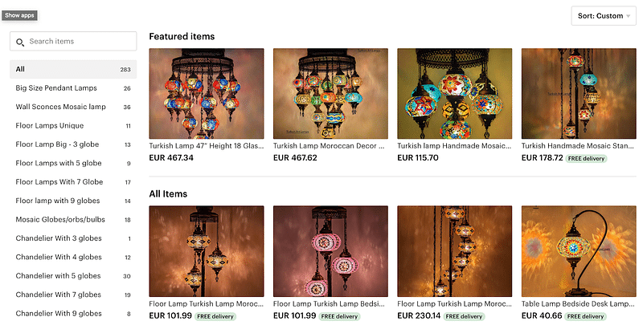
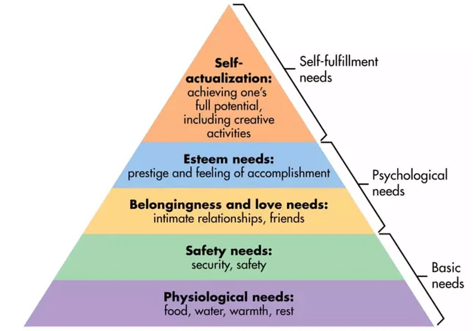
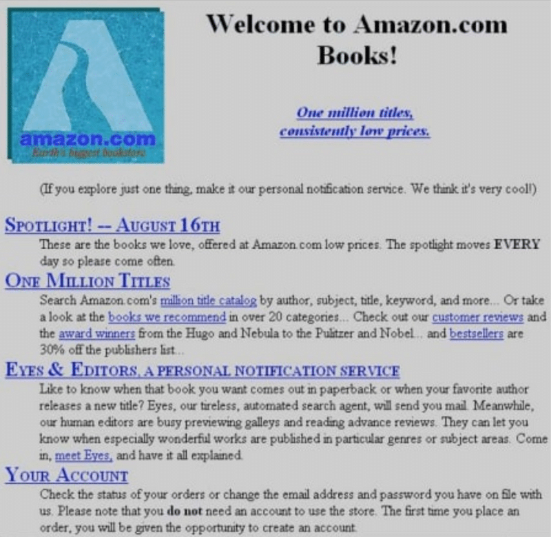
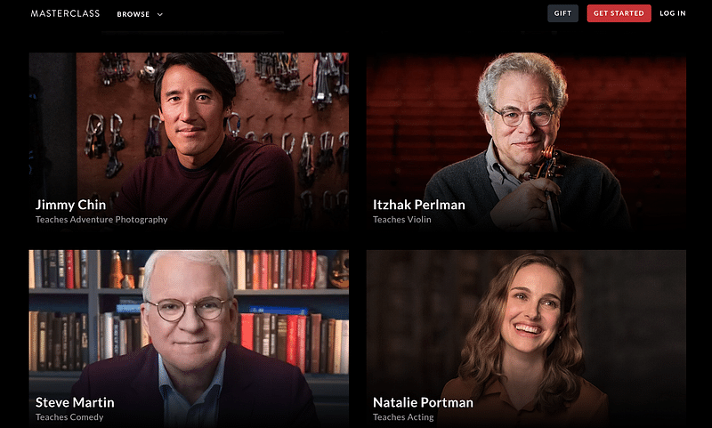

The future of marketplaces is unknown. However, the rise of the Passion Economy could be an opportunity to create marketplaces with passion-driven verticals.

Civilization was born out of the need to fulfill one’s needs through others… — Vargas Llosa

The next decade will be about passions, not gigs. — Li Jin

### Discoverability and Monetization are The Roots of the Marketplace

What good is it if you want to follow your passion, tell your stories, cook your delicacy or make the most beautiful shoe if it doesn’t reach the eyes of the buyer?

From the grand markets of Venice and Bazaars of Istanbul to today’s Amazon and Alibaba, the core concept remains: [building marketplaces](https://altar.io/blog/eight-steps-follow-build-successful-marketplace/) is relevant because they serve both the sellers and buyers at scale. They help both find each other (discoverability) and give the seller a means to thrive (monetization).

In the old days, you’d have to travel far to get what you wanted. Nowadays you have “buy now” buttons that order products from the other side of the world straight to your front door.

Fast forward to 2020, Amazon is now turning 36 years old. Several new waves have come and we are possibly at the peak “Uber for X/Gig economy” stage. We are posing questions such as what good is the gig economy for the gigster? How profitable and sustainable is it to drive people from A to B, do check-ins for BnBs or deliver your food?

There’s now a new wave of non-commoditized service and knowledge skills coming to the web.

These are skills that lie not in fulfilling basic needs but rather noble pursuits and highly specialized project executioners such as teaching cooking skills on Masterclass.com, creating and selling crafty leather wallets on Etsy.com. Or even craft beer classes on skillshare.com? That seems to be where we are now arriving to, in force, in the 2020s. This phenomenon has been called the Passion Economy. It’s about individual knowledge-intensive skills, not commoditized task fulfilment.

### Why the Maslow Pyramid of Needs Matters

The well known Maslow pyramid of needs represents a person’s basic needs. From survival and sustenance to prestige and love. As those needs are met people strive to attain the next higher levels of the pyramid.

The same happened with civilization. The need for cereals and vegetables by sheepherders brought about basic trade, say sheep for vegetables. As there was no more trading to do people went further away in order to trade their produce. This gradually put people in contact for the benefit of fulfilling needs — which was achieved by these trade transactions.

### Our Basic Needs

With the passage of time (helped by good weather, peace, fertile land and open borders) gradually trade routes are established. This creates a strong foothold in the “Basic Needs” section of the Pyramid as basic commodities travel from where there is a surplus to where there is a lack thereof for small sums.

Today people still trying to get a foothold on the Basic Needs segment are those unlucky to be in a part of the world that is barely integrated into modern trade routes. Think of war or drought-stricken parts of Africa. Or those in the developed world without differential skills, doing odd jobs to pay for food, rent, medical bills. The overall feeling is that they do not possess the means to live well, but rather survive. Such people are condemned to the worst _local_ jobs.

### Our Psychological Needs

The second tier of the pyramid is Psychological Needs. It is related to the first in the sense that, with the basic needs attained, one can live outside the “survival mode”. This allows them to contribute to society and have some breathing space to enjoy and pursue relationships.

We‘d put this on par with working to pay bills like rent and a car. Having a middle income allows for a certain feeling of accomplishment within the country. Generally speaking people in this echelon are employed in service jobs that are integrated within the global economy.

### Our Self-Fulfilment Needs

Finally, the upper echelon of the pyramid, the Self Fulfillment part, deals with something else entirely. It focusses on living not for sustainability and paying bills but for pleasure. Participants are highly skilled professionals with large disposable incomes directly contributing to the global market or to the local market in a highly globalised country. These people pursue their quests in accumulation, travel, highly specialized knowledge, artistry and being global citizens. Individuality and global audience mean disproportionate rewards in terms of audience, prestige and skill monetization.

If the correlation isn’t between the global marketplace and the Maslow Pyramid think of scale The bigger the audience the bigger scale in rewards. Those who can only look to fulfil Basic Needs have jobs that service the local economy (think street cleaners, coffee shop workers, subsistence farmers).

People who participate indirectly in the global market have middle incomes and strive to attain Psychological Needs (think call centre clerks, bankers, teachers).

People who participate directly in the global market are those who own the companies that trade globally or individually serve a large audience (artists, architects, freelancers, entrepreneurs, bloggers).

Interestingly, as we shall see, the history of the internet has mimicked this upward flow. Now it is reaching the top tip of the pyramid which is a promising development.

##### Do you have a brilliant startup idea that you want to bring to life?

From the product and business reasoning to streamlining your MVP to the most important features, our team of product experts and ex-startup founders can help you bring your vision to life.

Let's Talk

### The Evolution of Web Marketplaces: From Craigslist to Amazon, Uber and Now…

The 2010s proved the internet as serious business. It did so as technology companies finally outpaced the likes of AT&T, GE, EXXON MOBIL, JPMorgan to the absolute crown.

Amazon, Alibaba, Microsoft, Apple, Facebook and Google are now the behemoths of the world. They are the global companies that once banks were, the appeal is wholly now on working for such companies, not banks.

Related: [The List of the Most Active Marketplace Investors](https://altar.io/60-active-investors-focus-marketplaces/)

### 1995 Onward: The Yellow Pages/Phone Book

When the web had up to 200 million users, the first listing sites such as Craigslist which emulated the yellow pages phone directory. You would use these to look for a gardener, a plumber or even a date (though likely not the best place for the latter).

This served the first and foremost problem on the web: Having something to say or to sell and being found. Web classifieds showed for the first time, to many, that there could be business on the internet.

Listings couldn’t, however, sell anything. Nor could they take a cut, as they simply listed suppliers and derived any business from sponsored highlights.

### 1999s Onward: E-commerce Amazon, Netflix and Alibaba

Around the turn of the millennium new apps began to appear. For example Amazon for books (Est. 1994) and a few other vertical-specific sites like:

- - Pets.com for pet products (Est. 1999) — which failed spectacularly but is now a thriving segment

- - Netflix to borrow movie DVDs (Est. 1997)

- - Alibaba for B2B with a couple of verticals (Est. 1999)

Most went a little further and tried harder by offering non-vertical but rather generalist buffets of e-commerce products to buy. They offer…

1. To actually purchase online, not just know that there are items for sale — now that these sites also became brands and garnered enough confidence for someone to buy with a credit card
2. Far more items than any physical next door shop could
3. Deep discounts through bypassing part of the savings with renting an actual shop and paying clerks salaries.

This caused disruption to retail shops of all kinds from clothing to books. An example of extreme disruption is that of the video-club industry. Many kids are now growing up having never heard of Blockbuster and similar high-street video-clubs, for example.

It is an unfair comparison since Amazon now derives its sales from many business lines. But it’s still staggering to compare its 90$ stock to Barnes and Nobles 30$ stock in 2007. Whereas now Amazon’s is worth over 1800$ and Barnes and Noble just over 6.5$.

### The 2010s: The Uber for X/Gig Economy

This was also the decade of Uber (founded in 2009) and similar players. These services are not just for transport but for any kind of task (or “gig”). Ranging from the likes of Taskrabbit (f. 2008) for menial tasks to a Software Developer on Upwork — where the low price per hour is key. Different but also with many alike characteristics was the rent-seeking or sharing ability brought by Airbnb (f. 2008) and it’s competitors. In most cases the Uber for X Value and the Sharing Economy chain share most of the following characteristics:

1. The immediacy of the requests for services that may take place within minutes, such as ordering a meal, a place to sleep, a massage or a ride.
2. They are one-time services.
3. Price is, in most cases, the driver since you are fulfilling a basic need at a very low premium. You don’t hire a great driver but rather a ride. You order sushi that will likely be consumed unceremoniously, not a Japanese food experience.
4. The hourly fees charged by the workers in this supply chain are competitive and tend to be very low. They are barely higher than minimum wage and supply is not elastic. Meaning an Uber driver can only drive say 12 hours and an apartment on Airbnb maxes out at 365 days a year.

So who is truly disrupted by these companies? Well, that’s simple, just look at the negative impact on the taxi industry and mixed impact in the hospitality industry.

### 2020’s: The Passion-Driven Economy

This is where things get really interesting. We are now bringing discoverability, and monetization, of passions to the web. We see broadcasts of individual knowledge and skills from a vast array of differentiated people and specialised fields. On the web, this is the dawn of the higher echelon of the Maslow pyramid of needs/skills/people. It’s open season and it looks like, in 2020, business is going to be booming.

The web as the current height of civilization has mastered the mimicry of the pyramid of needs.

We’ve built on and matured from Maslow’s Basic needs — with basic tasks being attainable via the web (i.e. ordering food or a plumber or working as suppliers of such services).

In terms of Psychological Needs, the web has brought apps to look for relationships as well as middle-income service jobs.

We have now reached the fulfilment stage where we look for masters who will tutor us in our most noble pursuits and quench intellectual thirst.

Such is the case of Skillshare.com (Est. 2010), where a wide array of grassroots experts teach everything from maths to photography to digital marketing. Masterclass.com (Est. 2012) is another example, where world-class experts are invited to recorded lectures. Etsy.com (Est. 2005) is a passion economy where small & local craftspeople are able to sell their handmade goods to the world.

Yes, even Steve Martin is breaking into the Passion Economy!

The passion economy isn’t just disrupting these areas either. There is an ever-growing list of sectors adopting the passion economy…

In 2018 a [7-year-old reportedly earned himself 22 million](https://www.cbsnews.com/video/7-year-old-of-ryan-toysreview-youtube-channel-earns-22-million/) due to the ad revenue from the sheer numbers of his viewership on Youtube. His passion? Reviewing toys.

Amateur gamers are being paid to game and broadcast. Even the relatively unknown “[StoneMountain64](https://zw.youtubers.me/stonemountain64/youtube-estimated-earnings)” might have earned up to $500k.

Experts in many segments such as [Crypto](https://offthechain.substack.com/), the [Future](https://www.exponentialview.co/), [China matters](https://sinocism.com/), even [Victorian Writing](https://grace.substack.com/) and even “fact-based” [Journalism](https://thedispatch.com/) have started finding their desired monetization with [Substack.com](https://substack.com/) (Est. 2017). Top newsletters reportedly make over $10k per month and trending up.

Audio through the ever-growing adoption of podcasts is also booming.

Being one of the internet’s largest industries, porn is also undergoing a seismic shift. Starting with large professional studios in the 2000’s domination the web of porn, to the free and commoditized “YouTubes” of porn in the 2010s such as Pornhub.com (Est. 2007) Recently the web economy of porn was in a continual downtrend.

The recent rise of passion economy marketplaces in which each “star” creates content paid by subscribers, such as Manyvids.com (Est. 2014) and Onlyfans.com (Est. 2011) has brought new life into the amateur segment which now has a monetary incentive to broadcast its passion, quite literally.

Related: [Steps to Follow to Build a Successful Marketplace](https://altar.io/eight-steps-follow-build-successful-marketplace/)

### From Then to Now

Whereas the Gig Economy was about narrow tasks and one time fees, the characteristics of the Passion Economy Marketplaces are about one selling his/her hyper-personal knowledge, entertainment, skill or craft. This is superseding the limited one-to-one service basis, but rather selling digitally on a one to many basis. The passion industry often relies on a recurrent revenue subscription that scales without limit. Thus, the actual price per hour employed by the provider scales with its audience:

1. 1. Subscription over one time fees. Instead of buying a book by a writer, a cd by a singer or a newspaper to read an article you subscribe to the newsletter or a podcast.
    2. One-to-many leverage. Many people can buy-in. Instead of the Gig economy in which someone delivering your food can only deliver one at a time. In the Passion Economy, there are no set limits for who can buy.
    3. Hyper Personal skills instead of undifferentiated mere task fulfilment.

The opportunity here lies essentially on opening the wide market of the web globally for knowledge professionals & amateurs and locally for services and products beyond those of a Basic Needs nature such as subscribing to a psychotherapist or yoga sessions at home.

### Is There Space for Passion Economy Marketplaces?

Is there still an opportunity to create Passion Economy Marketplaces for specific verticals? I’d venture to say yes there is. Furthermore, I’m willing to bet [some investors](https://altar.io/blog/60-active-investors-focus-marketplaces/) will be keeping a keen eye on upcoming opportunities.

An example of this, that I know well, is [Vectoria Designs](https://vectoriadesigns.com/). They transformed from a local papercraft boutique into a global business using the passion economy marketplace Etsy. Through Etsy, it’s grown over 150% per year in the last 3 years — along with Etsy’s own eye-watering growth. It is also worth noting that this marketplace’s success relies entirely on the success of its participants.

The Passion Economy trend I believe will further consolidate as it seems to have plenty of high-value skills that do not yet have their marketplaces. There is an opportunity here to discover, monetize and build customer relationships. Here are just a few ideas of underserved verticals:

1. Linkedin/clarity/upwork disruption that allows you to browse profiles per professional vertical. Read their personal rich content blogs and book people for a meeting/consulting project — paying a price per hour.
2. Tutors for all specialities — to subscribe locally or remotely.
3. Psychologists/Psychotherapists.
4. Physiotherapists and masseurs — to subscribe locally.
5. Agriculturalists to subscribe locally.
6. Chefs to subscribe locally.

What else could a vertical-specific Passion Economy marketplace look like? Any ideas? I would love to know where you think this trend is heading!
