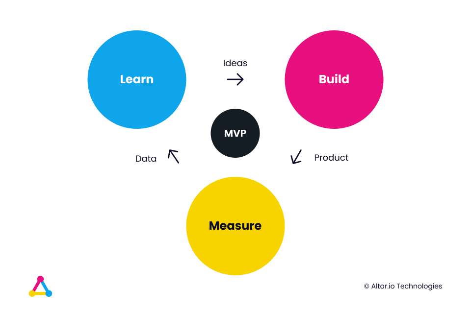

As a business person without the tech skills to build an MVP, it can be tempting to look for a software development partner as soon as possible.

It’s a common trap that many entrepreneurs fall into. But, before even thinking about development,  you should be focussing on your product reasoning.

It’s like entrepreneur and product expert Joe Procopio [recently told me](https://altar.io/expert-interview-building-an-mvp/#importance-of-product):

You can do everything else right but if the product isn’t right, you’re doomed.

You can recover from every other part of the MVP process failing. You can’t recover from a misfire on the product.

It’s vital you know the problem you’re trying to solve, who you’re solving it for and the solution they currently use to solve that problem.

Because if your users don’t see any value in your product, they simply won’t adopt it.

A great example of this is the [first iteration of Instagram](https://altar.io/ultimate-list-mvp-examples/#instagram) (or as it was then known Burbn).

Inspired by founder Kevin Systrom’s love of fine whiskeys and bourbons, it was designed to allow users to check-in, share their experiences and upload pictures.

He and his co-founder Mike Kreiger, spend a year building Burbn, releasing a fully-fledged product to the market.

**But the product missed the mark.** 

Adoption was poor, and users found the app confusing. Even [Systrom himself commented](https://techcrunch.com/2010/11/08/instagram-a-pivotal-pivot/) that the product felt “cluttered and overrun with features.”

This could’ve been the end of the story for Burbn & Instagram, but **Systrom and Kreiger went back to the core product and re-evaluated everything**.

They focused on the one feature that all their users loved: **easy photo sharing**:

We went out on a limb and basically cut everything in the Burbn app except for its photo, comment, and like capabilities. What remained was Instagram.

It was revisiting the product reasoning that kicked off the series of events that led to Systrom and Kreiger selling Instagram to Facebook for $1 Billion.

This is just one example of why startups should be putting more importance on the product as they build an MVP. And why many are beginning to onboard a Product Expert or CPO from day zero.

Throughout this article, I will show you the blueprint to prepare your product for its development phase. It’s the blueprint we use with all the startups we work with at Altar. I will also cover how a product expert can help you fill out this blueprint.

Then I will look at the MVP development stage itself. I’ll cover the options you have when it comes to selecting a tech stakeholder and how to avoid some common mistakes I’ve seen entrepreneurs make (myself included).

 

#### Contents

## What Does Help From a Product Expert Look Like?

A product expert is not dissimilar to a therapist. They’ll help you organise your ideas in order to come up with an action plan to move forward effectively and efficiently (the difference being that a product expert will actually suggest which plan you should undertake).

Depending on the stage your business is at, a product expert will generally divide the process into a series of sessions:

1. Define Your Value Proposition
2. Define the Assumptions to Validate
3. Play the Mirror Game

##### Do you have a brilliant startup idea that you want to bring to life?

From the product and business reasoning to streamlining your MVP to the most important features, our team of product experts and ex-startup founders can help you bring your vision to life.

Let's Talk

### Session 1: Define Your Value Proposition

As I mentioned at the top of the article, Session 1 is the critical first step in transforming your idea into a structured business vision.

Your product expert will start by helping you define your value proposition by guiding you through the following questions:

- **Who are our stakeholders?** Here you should describe the stakeholders that are interacting with your product. You should take into account demographics as well as psychological and behavioural factors in the observed context.
- **How do those stakeholders deal with the problem today, without our product?** Here you should define who your competition is (direct and indirect - for Henry Ford, horses would definitely be in) including their positioning, strengths and weaknesses.
- **What makes our product 10 times better than the current solution(s)?** Here you should describe what differentiates your product from the competition you listed above. Specifically, define the key elements that will drive the user to take action and switch to your product.
- **What are the potential reasons for a user to NOT switch to our product?** Here you should list any barriers of entry or elements that will stop users from switching. E.g. You build an enterprise software that is 1000x better than the current solution. But, because all of your stakeholders use that one solution, leaving it is more painful than dealing with terrible UX every day.

Once you’ve answered these questions, the next step is to sum everything up in an elevator pitch.

**Your elevator pitch has to be simple and crystal clear, so your users can easily see the value behind your MVP.**

It should look something like this:

**\_\_\_\_ (Name of your product)** has been conceived for **\_\_\_\_** **(your stakeholders)** who **\_\_\_\_ (state their problem)**. **\_\_\_\_ (Name of your product)** is a**\_\_\_\_\_ (a statement of its key benefit/solution)**. Unlike **\_\_\_\_ (the current solutions - e.g. for Henry Ford it would be horses!)** we **\_\_\_\_ (say what differentiates you from the alternatives/your existing competition)**.

To take this concept one step further, here is an elevator pitch example for Uber (information taken from Uber’s original pitch deck – [which you can see here](https://medium.com/@gc/the-beginning-of-uber-7fb17e544851)):

**Uber** has been conceived for **people who want a taxi service** who **are tired of the poor, inefficient service provided by overpriced taxis**. **Uber** is a **fast and efficient on-demand car service**. Unlike **traditional taxi services,** we provide **the ability for the user to use an app to hail a cab to their exact GPS location with ease. Moreover, we provide the ability to “rate your trip” to ensure drivers are accountable for the service they provide (and passengers for how they behave).** 

Once you have this, you’ll have completed the session and it will be time to move onto the next step – defining the assumptions to validate.

### Session 2: Define the Assumptions to Validate

“Assumptions” are those user actions that are key for your business, but at this stage, you don’t know for sure that they will take those actions.

For example, Airbnb assumed a number of user actions before building their initial product – for example:

- Travellers want true experiences, not a hotel that leaves you disconnected from the city you’re visiting.
- Hotels are expensive – which is a barrier for some travellers if it’s their only option.
- Travellers would be happy to stay in a stranger’s house to experience the city authentically and save money.
- Hosts would be happy to open their homes to complete strangers so they can earn some extra money renting out their spare room.

With the help of your product expert, you should list all the assumptions surrounding your product – as I did with the example above.

Once you have that list, you should select all of the assumptions that can easily be validated with research. Take for example validating that hotels are expensive can easily be done with a bit of research.

Then, you should be left with a set of assumptions that can only be validated with a working app.

For those, you need to move on to the final session – playing the mirror game.

### Session 3: Play the Mirror Game

This session starts by listing all the features you want your product to have. From the fanciest, sexy features to the most basic and mundane ones.

Now put this list next to the list of assumptions you made in the previous step.

For every feature, ask yourself:

**Is this feature absolutely necessary to prove one of the assumptions on the list?**

If yes, build that feature into the first version of your product/MVP.

If no, put it to the side. Mark it as a “nice-to-have” feature to consider in the future.

To take it a step further, here’s an example using Airbnb – starting with the feature, followed by the consideration behind it:

- **Sign Up/Login:** Yes! How can you book a spot without logging in and saving your information?

- **List of available apartments/rooms:** Yes! It’s important that travellers can see what’s available and choose based on their requirements.

- **Booking system:** Yes! This is the easiest and most organised way to connect hosts and travellers.

- **Recommendation system to show the user apartments based on their preferences:** No! Sure, this is a nice feature to have and makes the user’s life easier – but it doesn’t prove any of the assumptions listed in the previous example.

- **Referral system**: No! For the same reasons as the recommendation system.

- **Geolocalisation search:** No! This is nice to have but does not prove our assumptions

- **Calendar Integration:** Absolutely unnecessary at this stage.

Once you’ve compared all of the features you **want** with the assumptions you **need to prove** you’ll have taken into account all the product considerations you need to build a truly lean MVP.

Related: [How to Build a Successful Minimum Viable Product (MVP) in 3 Steps](https://altar.io/features-inside-mvp-3-steps-know-answer/#how-to-build-an-mvp-3-steps)

### The Practical Advantages of a Product Expert

A Product Expert can also help you compile all of the documents you need to bring to a software developer, or agency – including but not limited to:

- **UX Personas:** an in-depth analysis of all the stakeholders, in order to help to guide decisions about the product and also to help to prioritise the key User Stories for the MVP.
- **User Stories:** story of the journey users take through the product. This is better than a list of features because it keeps the user at the centre of the process.
- **BPMN:** (Business Process Modeling Notation) is a flow chart method that models the steps of a planned business process from end to end. This is usually needed at this stage when we have complex workflows to be sure that you’re not missing any important detail in the main flows.
- **Sitemap:** Structure of the whole app, with all main and secondary pages.
- **UX/UI key screens:** UX wireframes and UI mockups of the main representative pages of the app (this is the most practical and the one that gives you a real taste of your product).

Once you have this documentation in place, you’re finally ready to move forward to the development stage with a structured business vision.

Significantly decreasing your chances of being ripped off and significantly increasing your chances of building an MVP that’s in line with your target users needs.

## With Your Structured Business Vision in Hand, It’s Time to Approach Developers

The next step, after you’ve structured your business vision, is to approach a technical partner that will actually develop your product.

When it comes to finding a technical partner to help you build an MVP you have three options:

- Find a kick-ass CTO
- Hire a team of Freelance Developers
- Onboard a Software Development Company

There are several considerations to make when choosing this initial stakeholder.  I’ll now go deeper into each of them, starting with finding a CTO.

My co-founder, Daniel, has written an extensive guide on how to choose the right technical partner for your startup, [which you can check out here](https://altar.io/whats-the-best-way-to-build-your-startup-cto-freelancers-agency/). I’ve included a short summary below to give you an idea of the process.

### Build an MVP with a CTO

There’s no denying that bringing in the perfect CTO is the most idyllic option. And if you’re able to find them before you’ve built your MVP you should jump at the chance to onboard them.

That being said, it can be incredibly difficult to find them. I’ve seen first-hand entrepreneurs spend six months or more looking for a CTO and coming up empty-handed.

It’s something that Dudley Gould, a UK based entrepreneur I worked with recently, [faced first hand](https://altar.io/building-a-startup-without-a-technical-co-founder/).

For this reason, many entrepreneurs look to freelance developers to help them build their MVP.

**_For more information_** _on finding your dream CTO,_ [_check out this guide_](https://altar.io/how-to-find-a-cto-for-your-startup-the-founders-guide/)_. It explains the exact set of characteristics you should be looking for in a CTO._ 

### Build an MVP with Freelance Developers

The first benefit of freelancers is you can hire them on an “as-and-when” basis.  Therefore, you’re only paying for development when you need it. Moreover, there is no long term commitment, so if it doesn’t work out with one freelancer, you can easily find another.

And with [remote work becoming more and more normal](https://altar.io/remote-work-vs-the-office-whats-best-for-your-startup/), you’re also able to cast a wider net to find the best talent available.

That’s not to say that hiring freelance developers doesn’t come with its downsides.

Namely, from a management perspective. Managing a team of developers takes time and effort – and can be extremely challenging especially if you have no prior experience doing it.

The risk here is that it takes time away from what you should be focussing on – the business side of your startup.

It’s for that reason many entrepreneurs turn to the final option:  onboarding a software development company to help them build an MVP.

### Build an MVP with a Software Development Company

Many entrepreneurs who can’t find a CTO early on instead choose to build an MVP with a software development company.

As with freelance developers, there is more flexibility than hiring a CTO.

It’s easier to manage a software development company, as agencies will have a project manager on hand to ensure development is going smoothly.

Lastly, when working with an agency, you have access to a wealth of knowledge, expertise and experience.

An agency worth its salt will have built hundreds of MVPs and fully-fledged products. It’s very likely they’ve already built an MVP similar to yours – even if it’s just because it’s in the same industry.

Having that expertise on hand can be hugely beneficial when building your MVP.

Working with an agency also allows you to keep looking for your dream CTO, without slowing down your time to market – as you’re able to develop your product at the same time.

More than this, bringing your MVP to market will actually attract potential CTOs to your company.

This is something I [discussed recently with Nelly Yusupova](https://altar.io/what-founders-should-know-before-hiring-a-cto-or-software-agency-expert-interview/). She's a CTO with nearly two decades of experience in the tech industry.

Here’s what she had to say on how building an MVP can help you find a CTO:

It’s about traction. Showing technical stakeholders that this isn’t just an idea. It’s a painkiller and people want it. You’re saying to them, look what I’ve already done without you, imagine what we can achieve together.

That doesn’t mean, however, that working with an agency doesn’t come with its own set of risks.

**Choose the wrong agency, and you could end up out of pocket, and in a worst-case scenario without a product.**

We worked with an entrepreneur who faced this first hand back in 2019.

Before working with us, he outsourced with an offshore agency that offered him a great price and an even better time estimate.

They offered to build him a fully working marketplace (full of non-standard features) in two months.

Six months later, he still didn’t have a product. So he asked for a code audit. The outcome of which showed that the platform was unusable. 100% of it had to be trashed.

Luckily, he had enough money to start from scratch. But not everyone has this luxury.

My point is, if it seems too good to be true, it probably is.

**_For more information_** _on outsourcing successfully with a software development company,_ [_check out this guide_](https://altar.io/founders-guide-how-to-outsource-software-development-2020/)_. It will lead you through the entire process, including the red flags to look out for._ 

Once you’ve found your technical stakeholder, and built the MVP, it's time for the next step: the launch.

## Launching & Iterating Your MVP

Once you’ve built your MVP, it’s time to put it in the hands of your users, and employ the build, measure, learn cycle.

The first step is to **measure** the feedback from your users.

With that feedback in hand, look at your feature list and user stories. Use the feedback to **learn** how your product can better suit your users’ needs.

Finally, **build** those improvements into your product.

Then, go back to the beginning and start this process again. This will allow you to continuously iterate your MVP, adding features as you go until you’re left with a fully-fledged, user-centric product.

### How to Implement the Build, Measure, Learn Cycle

When it comes to the interaction stage of your MVP, you have the same options you had before:

- Hire a CTO (or onboard them as a partner)
- Stick with the freelance devs
- Continue with a software development company.

It’s worth noting, however, that **w****ith a successful MVP launch, you are now in a much stronger position to attract a CTO**

Remember [Nelly’s advice](https://altar.io/what-founders-should-know-before-hiring-a-cto-or-software-agency-expert-interview/) that I shared earlier in the article.

Of course, you can carry on with freelance developers. After all, now you have some experience managing a technical project (even if you built your MVP with an agency, you became a little more knowledgeable about rituals and tricks to be effective and get the job done). As well as a working relationship with dependable freelancers.

Or, if you built your MVP with a software development agency, you can stick with them too.

As a founder of a software development company, here I can tell you the most common approaches that you’ll find out there:

- **Time and materials model:** Paying as you go for development, as and when you need it, as you iterate your MVP.

- **Dedicated Team:** This is where the agency allocates a small development team to work solely on your startup. This usually comes with a minimum time commitment. However, as a result of it being more stable than T&M, it usually comes with a reduced cost. To read more about dedicated teams, [check out this article](https://altar.io/ultimate-guide-dedicated-software-development-team/) written by my co-founder André. He’s compiled his wealth of experience building dedicated teams into an easy-to-digest actionable guide on the topic.

- **A Hybrid of The Previous Options:** This is where operational resources (e.g. developers) are part of a dedicated team framework. Whereas senior resources (such as CTO level advice) is paid for on a T&M basis. This will save you money as you don’t need senior resources on a full-time basis – so there’s no point paying for them on a full-time basis.

**While continuing development with freelancers or an agency will work – I would recommend internalising the team sooner rather than later.**

Despite tech not being the [core of your startup](https://altar.io/should-a-startup-outsource-its-software-development/), it’s always a great idea to have great talent in house.

Firstly, it makes it a lot easier and faster to pivot your company should you need to.

Secondly, your company is going to continually be building knowledge on your user behaviours as you grow. Having that information in house (and not spread across freelancers or consultants) means that that knowledge can be shared easily across different departments.

Finally, it’s important to note that when you do bring your development team in-house you’ll need to transfer the knowledge from the agency’s development team to a team of devs.

This can be a massive headache if handled poorly. For example, a cold handover of documentation, a quick workshop for the new team and see you later.

The best way to do this is to have both teams work together for a certain period of time. The length of time is completely dependent on how long you’ve worked with the agency, the complexity of your product, etc.

The objective here is to gradually phase out the agency’s team as the new, in-house team’s confidence grows as they absorb the knowledge.

This is a heavier commitment than a quick one-time handover of materials but will save you a lot of headaches in the long term.

## Wrapping Up

While it’s important to build an MVP quickly, taking the time to structure your product will save you a lot of time and confusion later down the line.

This preparation will help you give clear instructions to your software development partner – regardless of who you choose.

Then, once you’ve launched, assuming your MVP sees adoption, you’ll be in a great position to iterate until you’ve built a fully-fledged user-centric product.

Thanks for reading.
