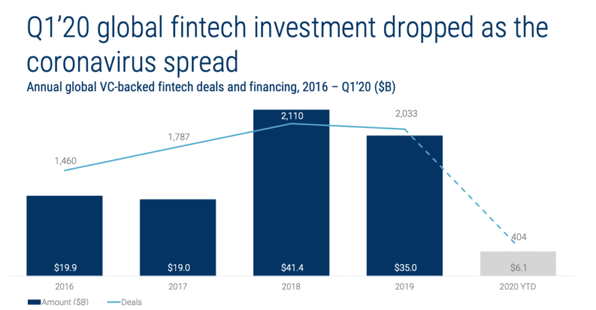

As you may know, at Altar, we’ve been [operating in the fintech sector](https://altar.io/work/) for the last couple of years. In the early days, we struggled to understand who we should contact at which [funding stage](https://altar.io/startup-series-funding-everything-you-need-to-know/).

That is why I’m glad to share with you our public list of over 150 Fintech investors, we’ve met, with all the information you need to create your wishlist and then go to battle.

But before I get to the list and provide you with some aggregations; I want to first talk about the impact of COVID-19 on the fintech sector and its investors

#### Contents

## The Impact of COVID-19 on Fintech Investments

When the outbreak of the coronavirus pandemic hit, investment on a global scale was thrown into disarray.

In Q1’20 there was a noticeable impact on fintech investments, especially at the seed stage, from [Venture Capitalists](https://www.valuer.ai/blog/100-top-venture-capitalists-in-the-usa), Angel Investors and Private Equity.

CBInsights’ Q1 Fintech Report stated that “Q1’20 was one of the worst quarters in 2 years for VC-backed fintech.”

Fast forward a year, to Q1’21, however, and the story couldn’t be more different.

Q1’21 was the largest quarter for fintech funding on record.

[CBInsights observed that in Q1’21](https://www.cbinsights.com/research/report/fintech-trends-q1-2021/):

“Across 614 deals, VC-backed fintech companies raised $22.8B. This represents 15% and 98% year-over-year (YoY) growth, respectively.”

It's safe to say that fintech investment has rebounded since the outbreak of COVID. Now, let's move on to the list of the most active fintech investors.

##### Do you have a brilliant startup idea that you want to bring to life?

From the product and business reasoning to streamlining your MVP to the most important features, our team of product experts and ex-startup founders can help you bring your vision to life.

Let's Talk

## The List of Most Active 150 Fintech Investors

The list, comprising of Venture Capital Firms, Angel Investors & Private Equity Firms, contains:

- Name
- Link
- Investor type
- Investment stage
- Location
- Country
- Founding year
- No. of Exits
- No. of Investments
- Email
- Phone
- Link on Crunchbase
- Fintech portfolio

Sure, you know, nothing replaces personal intros from people that can vouch for you. So take your time doing due diligence on potential connections of associates and partners at the best fintech investment firms. Then ask the strongest connector for the introduction.

**Quick tip:** look at your 1st or 2nd connections on Linkedin and ask for intros to firms that list specialized investors in Fintech. And remember: best introductions come from people who have brought them good deals in the past.

Otherwise, feel free to contact them directly using our list of the most active 150 investors in fintech. Full disclosure: as you can understand we cannot share personal contacts, so the list has general contacts only.

Also bear in mind that, according to a DocSend survey, you need to [contact an average](https://www.forbes.com/sites/alejandrocremades/2018/08/05/top-50-angel-investors-based-on-investment-volume-and-successful-exits/#182d85ef7748) of just 58 investors, make 40 meetings, and take just 12.5 weeks to close your funding round, so get ready for some work ahead of you.

Access the list here: [150+ Fintech Angel Investors, VCs and Private Equity Funds.](https://docs.google.com/spreadsheets/d/1L5uGl0-tVc2tSPF98L6bmpfx7NzGf8XTTcfsuo79qew/edit#gid=0)

Full Name Business Email Subscribe

## Some Aggregations

### **Fintech Investors: Geographical Presence**

In the Global Picture and as expected, most of the Institutional Investors are based in the US and UK. However, the EMEA Region (Europe, Middle East and North Africa), Germany, Switzerland and Sweden are worth mentioning, with 5%, 3%, 3% of the Fintech Institutional Investors respectively.

In the APAC Region (Asia Pacific), Singapore stands up with 4.5% of Fintech Investors.![The List of Most Active 150 Fintech Investors [2020 Update] - Investor Presence Geographically](https://cdn-images-1.medium.com/max/1440/0*7tT9MYuYyfK6Cn59)

### Fintech Investors: Stage Focus

The majority of the Fintech Institutional Investors covers both the Early and Late Stage investment rounds (68%).![The List of Most Active 150 Fintech Investors [2020 Update] - Investor Focus at Funding Stages](https://cdn-images-1.medium.com/max/1440/0*o-2rwPBAqnvmb9RT)

### Performance (in terms of n. Exits over n. of total Investments)

This statistic, for obvious reasons, has been performed on UK and US Fintech Institutional Investors only.

Good performances have been achieved in both of the Countries, with US standing one step ahead compared to the UK.

Here below you have a breakdown of the Fintech Investors with their statistical position in terms of performance.![The List of Most Active 150 Fintech Investors [2020 Update] - Investor Performance in the US vs the UK](https://cdn-images-1.medium.com/max/1440/0*r0zbL4sfxwsZXssd)

## Final Thoughts

There are many challenges when it comes to startup funding. Although the recent pandemic caused a flux in the status quo, the same “rule” still applies - persistence is the key to success.

Target investors most suited to your business needs, be proactive when communicating with potential investors and look out for the [hidden details when funding your startup](https://altar.io/expert-interview-funding-your-startup/).

Finally, when using [this comprehensive list of active fintech investors](https://altar57146.activehosted.com/f/3), research their networks. Try to find a mutual connection who can help you get your foot in the door via a warm introduction.

Good luck and thanks for reading!
