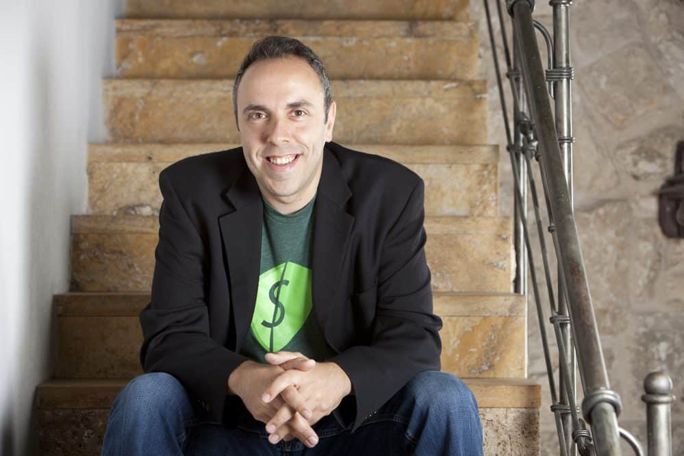

Being a software development agency that works with entrepreneurs to help them build their startups, our whole marketing strategy is focused on creating valuable resources to help them turn their visions into reality.

Recently, our team was working on one of those resources – an article explaining the benefits entrepreneurs can gain from going through startup accelerator programs like Y Combinator and 500 Startups.

And although that article was fantastic from a theoretical perspective, I felt like we needed some information in that article from people who had experienced it.

So I started reaching out to alumni from Y Combinator and other major accelerators who had gone on to successfully build a startup. I asked them to sit down with me for 15 minutes to share their experiences and the story behind their startup journey.

[Gary Lin](https://www.linkedin.com/in/garyjlin/) was one of the many entrepreneurs who were more than happy to sit down with me.

He’s worked as a software engineer with some of the biggest tech companies in the world, including Facebook and NVIDIA.

Now, he’s built [Airwork](https://www.airwork.io/), a platform that allows workers in Canada to pick up shifts at local businesses and get paid the same day. He was accepted into the Winter 2022 batch of Y Combinator and, since then, his startup has gone from strength to strength.

Despite only just launching its private beta at the end of 2022, it’s already revolutionising accessibility to shift work in the Greater Toronto area and has raised over $1.5M.

But it wasn’t all sunshine and rainbows for Gary and his startup.

Airwork was originally planned to be a B2B SaaS platform for automated remote onsite tech interviews, called Litebulb.

However, as Gary shared during our conversation, he and his team quickly realised that getting an ROI on their value proposition was close to impossible.

So they pivoted and Airwork was born.

In this article, Gary shares valuable insights into not just his experiences at Y Combinator, but the lessons he’s learned as an entrepreneur with nearly a decade of experience in the tech industry.

#### Contents

## About Gary Lin and Airwork (Formerly Litebulb)

#### **Rui:** Gary, to start us off, let’s talk about Litebulb. I really liked the idea of making interviews with tech stakeholders more efficient. Mainly because that process is something we’ve found takes an awful lot of effort here at Altar.

#### A People Interview, Technical Challenge, Technical Interview, Culture Conversation. It’s a lot – especially when you consider you’re talking to a talent pool that will often receive 20+ job interviews a day.

#### All of this to say, I would jump at the chance to make that process simpler – and having spent much of my professional career talking to non-tech entrepreneurs looking for devs, I know I’m not alone.

#### So what made you decide to take such a hard pivot to Airwork – a product that tackles a completely different problem?

**Gary:** So, when we took the decision to pivot, one of the first things I did was share a [post on LinkedIn](https://www.linkedin.com/posts/airworkhq_pivot-buildinginpublic-litebulb-activity-6950209321200730112-1WmY?utm_source=share&utm_medium=member_desktop) with the reasons why. I like to be very transparent with our community and publicly share our reasoning at every opportunity.

In that, we described the top three reasons behind the decision to pivot. The biggest reason was that we couldn’t figure out how to get a positive ROI on the value proposition for Litebulb - which was essentially automated technical onsite interviews.

As you touched on, interviewing engineers is a pain in the ass. So we came into it thinking how can you do that fast, accurately and – ideally– as automated as possible.

The biggest time sink when it comes to these interviews are your engineers reviewing applicants' code, talking to them, coming together with the rest of the team and effectively making the decision.

That takes time, and an engineer's time is expensive. For every hour an engineer doesn’t spend coding, the companies basically lose 10 hours worth of productivity.

It’s a 1:10 ratio. And then when it’s a higher-paid engineer, that ratio gets even higher.

A great example here comes from a company called Brex. In 2020 they spent roughly 36,000 hours interviewing engineers. That’s an entire Series A startup's worth of time in terms of development. Which is insane.

With all that in mind, the value proposition of Litebulb was appealing to a lot of people.  And we had a lot of big clients show interest early on. The problem is we kept losing money on the processes and we had no clear path to getting to a point where if we put a dollar in, we could get more than a dollar out.

Here’s why. Basically, we're automating onsite interviews, which is hard because they’re effectively production systems where you have to write a real feature.

There’s a live database with a back end, a front end,  a set of Figma mockups, and some specs from a PM.

And we’re saying to candidates “Go build this feature.” In order to detect whether or not the candidate did a good job of that.

Problem number one there is that, good is very subjective here.

Nobody could agree on what was classed as a strong engineer. Nobody could look and objectively say “that’s a strong intermediate” or “they’re a senior but they’re not that good.

Problem number two was that we could not automate it properly. It was never a hundred percent fully automated.

There was a point where we would write tests and candidates would keep breaking them. They would come up with newer and more creative ways of building a solution that we would never have thought of.

An example, right now, we’re having this conversation on Zoom. If I click “share screen” I expect a box to come up that asks me which screen I want to share.

Well, apparently there are a thousand ways to build that I would never have considered. Some candidates would build layers of divs and then place the ID in a different layer. So we could never detect which layer that ID was on.

This meant that, when we tried to mimic that with an automated test, it would just fail.

Our senior frontend engineer was working on the base (simple) test for about four months. We couldn’t get past the point where less than 30% of our candidates wouldn’t break the test.

So, at the end of the day, we sat down and realised we were never gonna get it down correctly. So then the discussion came around about removing the automated interview part of the product – which was kind of the entire value proposition.

It was not worth the time. It was not worth the energy for us and the market was not in the right direction for engineer hiring because of the recession that was coming on.

We were discussing what to do next because we had some money funding behind us but $1.5M isn’t a whole lot for senior developers who’re used to getting Silicon Valley money. It doesn’t leave room for a lot of runway.

So we decided to focus on something that we could release live within our runway. Which is why we decided to pivot.

Related: [When & How to Pivot Your Startup \[With Real-Life Examples\]](https://altar.io/startup-pivot-guide/)

## The Idea for Airwork

#### **R:** Thank you for sharing that. And it’s quite clear now. From the technical aspect to the direction of the market it simply didn’t make sense.

#### In my opinion, you made the right decision to pivot and not linger on the project just because you were emotionally attached to it.

#### So where did the idea for Airwork come from? Because it’s a completely different market and value proposition.

**G:** So, once we’d decided to pivot, we just started hammering ideas. We went through 20 ideas in two weeks. Airwork is what came out on top.

And it’s not an original idea. [Instawork](https://www.instawork.com/) has been around for a long time and they do the same thing. There’s a handful of other companies also doing the same thing and growing pretty quickly.

So that told us there was validation in this space. It also made us realise that there’s no similar solution in Canada – despite the fact it’s a pretty large market for temp work.

The hiring space in general is about $10B TAN in Canada alone. More than that, Instawork recently started making moves into the Canadian market after being live for seven years.

This told me that they saw potential in our market. The space was, more or less, de-risked by others. So the only thing missing was a solution in the Canadian market.

It was starting to look like this could work. My dad does a lot of warehouse work. He works with a temp agency and has faced the (very common) problems first-hand.

Here an immigrant can be a highly educated, respected, successful professional and as soon as you arrive in Canada it means nothing. You have to work from the ground up.

I know this because my dad has a PhD in microbiology from the University of Amsterdam. He came to Canada – couldn’t find work. Four or five years and nothing. He can speak English, he’s published microbiology books before in English, they just didn’t recognise his education because he earned it outside of Canada.

So now, he does warehouse work. This is an issue I’ve seen with so many people. Go to an Uber driver in Vancouver and ask them about their education. More than half will have Masters's degrees and PhDs. Completely overeducated to be doing what they’re doing yet they can’t find work.

So one thing that we want to do is help solve this problem by giving, first of all, at least some flexibility to workers that work in warehousing, in event staff, in cleaning staff restaurants. Effectively all blue-collar work. We wanna make it such that you can get yourself back on your feet and work on your own time.

But more than that, you can choose the kind of work you want to do, level up and regain a stance closer to what you used to have before.

So that was the genesis of the idea of Airwork.

Related: [Building a Successful Fintech by Listening to the Market (Founder Interview)](https://altar.io/building-a-fintech-by-listening-to-the-market-founder-interview/)

## The Reasons Behind Applying for Y Combinator

#### R: What made you decide to take that idea and apply to an Accelerator?

**G:** So we were always focused on applying to YC. I was rejected the first three times, but we got in on the fourth try.

YC has always been the gold standard in my book, so we never looked anywhere else. I’m not saying that YC guarantees success, but it certainly starts you out with an almost unfair advantage.

The network is particularly useful. Before we got into YC  we had already raised a million-dollar preseed round. It was a couple of weeks after that we got the news that we’d been accepted into YC and my first thought was “well I’m already diluted, should I be giving up another 7% so soon?”.

It didn’t make any sense to me, so I reached out to some friends who’d been through YC and they all told me the same thing:

If you have the chance to go to Y Combinator, do it. It changes the way you think, you want to be there.

So I went for it and they were completely right. It really does change the way you think.

## The Process of Being Accepted by Y Combinator

#### **R:** That’s interesting because I’ve had a few conversations with entrepreneurs who applied to YC because they were looking for funding.

#### These were proven entrepreneurs who’d already built and sold startups. But they still couldn’t raise money. Going through Y Combinator was more solid to investors than their previous successes.

#### You mentioned you got in on the fourth try, what did that process look like?

**G:** The first two attempts were with my former startup. Then with Airwork, I applied the first time and it didn’t work.

In that application, I was trying to sell.

I was trying to sell myself, the vision, the company, the idea it was going to be a massive opportunity – all of that.

So the second time I did the opposite of selling. I told them about as much of the company as possible in the shortest application possible. I also told them ‘Look, this idea probably won’t work, but if it does it’s gonna be great.

That was the application that led to being accepted. It was also the one that took me the least amount of time. The first time I applied I took about a week to gather all the content together.

The successful application took me around two hours. Within a month or two they got back to me saying they wanted to do an interview.

Related: [Successful Founders Share What To Expect From a Startup Accelerator](https://altar.io/founders-share-what-you-can-expect-from-a-startup-accelerator/)

#### **R:** And do you have clarity on what it was that made them say yes?

**G:** Absolutely. And it really comes down to one, simple factor.

Does the founding team appear formidable? By that I mean, are they truly dedicated to building a successful startup?

The idea you’re working on almost doesn’t matter – because if it turns out that it doesn’t work you can pivot up to one week before demo day and you’ll still get good traction. You’ll still be in with a chance of building a great startup.

And that comes down, again, to how formidable the founding team is.

Expert Tip 

Early-stage investors back great founders. They know that everything else is going to change. The product, the market, the competitive landscape will all change, but they’re betting on you.

Yaron Samid, Serial Entrepreneur , [Startup Advisor](https://www.linkedin.com/in/yaronsamid/)

## The Y Combinator Experience

#### **R:** Perfect. And what does a typical week look like at Y Combinator?

**G:** Yes, it’s a very simple answer: talk to users and write code. That’s it.

#### **R:** There’s something beautiful about that. Learn about the people you’re solving the problem for and build the best solution possible.

#### What was the best thing about your Y Combinator experience?

**G:** The fact I learned how to trim out all of the bullshit. They taught me rigorously that if you’re not talking to users or writing code, you’re wasting your time.

And it’s surprising how much convincing that takes. Everyone is obsessed with trade shows, networking events and getting t-shirts printed – all of that is worthless.

Expert Tip 

Your MVP won’t work if your customers can’t see any value. Build what customers want and then scale.

Joe Procopio, Product Expert, [Startup Founder](https://www.linkedin.com/in/joeprocopio/)

#### **R:** This one cuts close for me because I spend so much of my time telling entrepreneurs to talk to customers.

#### Forget your branding, no one cares what colour your logo is, no one cares if your team are all wearing cool, matching t-shirts at a trade show.

#### It’s not even about you. It’s about them.

#### They want the best solution possible for the pain they’re facing daily. Full stop.

#### So, to go back on track,  what would you say are the benefits of going through Y Combinator? Or any accelerator program for that matter.

**G:** It’s very helpful if you don’t have that initial network in the Silicon Valley tech world.

A couple of batchmates of mine were fairly well-connected in Europe, but they had no connections to either American investors or American tech companies.

And, for better or worse, that’s still where the big money is. It’s where the big network is.

And YC is just an easy way to get that handed to you on a plate.

Related: [How a Startup Accelerator Catapulted my Entrepreneurial Journey (Founder Interview)](https://altar.io/founder-interview-startup-accelerator-alumni-500-startups/)

#### **R:** Do you still have a connection with Y Combinator?

**G:** Of course. The contact points are, obviously, far less frequent than when we were on the batch, but they’re still very much involved in the journey.

I send investor updates monthly and they’re part of that – and I always hear back from the partners whenever I send that.

But more than that, I have an open door with the partners and I can reach out to them whenever I need to for mentorship and guidance.

Lastly, there are organised meetups, both virtually and presentially, with other YC alumni It’s super valuable even just for the fact that I can talk to a group of people who’re all doing the same thing as me – trying to build a successful startup.

## Advice to Entrepreneurs Thinking of Applying for a Startup Accelerator

#### **R:** Final question: what advice do you have for an entrepreneur or founding team that's about to fill out an application for YC or any other startup accelerator?

**G:** That’s an interesting question.

I think the best piece of advice I can give, from my experience, is to build your business in such a way that it has a high likelihood of failure. But, if it succeeds, it will go stratospheric and take over the entire market.

And then be very clear and bold about that when you fill out your application. Openly tell them that, yes, there’s a 0.1% chance that this idea will work – but if it does it’s going to be huge.

And tell them that in as few words as possible. Ambitious yet succinct.

## Thank You, Gary…

… For taking the time out of your busy schedule to talk to me.

There are many lessons Gary shared in this interview, from knowing when to pivot to the power of being honest, transparent and succinct when showcasing your business vision.

But the number one takeaway from our conversation, for me, is the importance of talking to customers.

You can have a beautiful logo, a gorgeous user experience and stylish matching t-shirts that impress at trade shows.

But if you’re product doesn’t solve your users' problem effectively, they’re simply not going to use it.

Thanks for reading.
